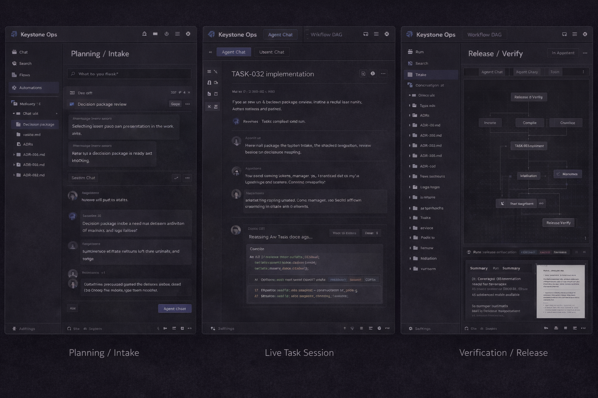
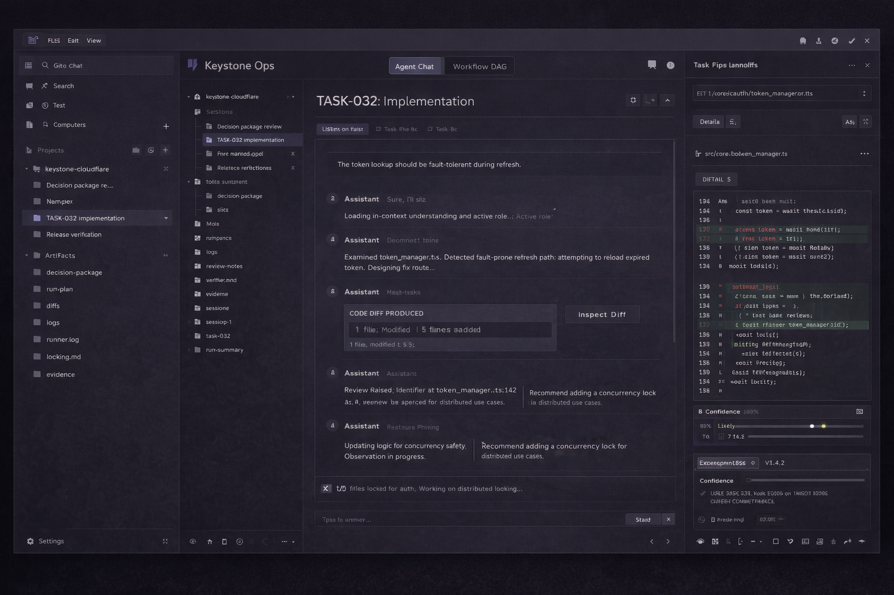
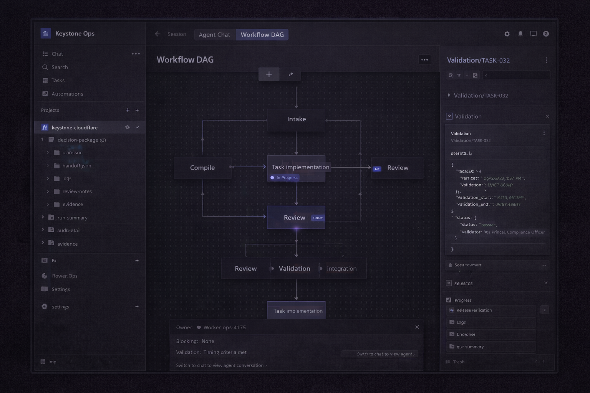

# Design References

This directory now has three distinct kinds of reference material:

## 1. Committed External References

These are the source reference screens under `external-reference/` that informed the Keystone direction:

- `external-reference/screen-1/`: intake and planning reference
- `external-reference/screen-2/`: workflow graph reference
- `external-reference/screen-3/`: task execution reference
- `external-reference/screen-4/`: verification and release reference

Treat these as committed source inspiration, not Keystone-owned concepts and not the current visual target.

## 2. Current Target References

These are the new images under `target-reference/`. They reflect the current direction we want to build toward:

- `keystone-target-board.png`
  Three aligned views showing intake, live task work, and verification/release inside one consistent shell.
- `keystone-live-task-chat.png`
  Focused reference for the task-scoped chat mode.
- `keystone-workflow-dag.png`
  Focused reference for the workflow DAG mode and task handoff into chat.

These are the images that should guide new UI work unless a newer target set replaces them.

## 3. Design Rules

`design-guidelines.md` is the translation layer between the source references and the Keystone target.

Use it for:

- shell rules
- pane responsibilities
- mode-switch behavior
- naming and artifact language
- visual consistency constraints

### Preview: Cross-Phase Target Board

### Preview: Task-Scoped Chat

### Preview: Workflow DAG Mode

## External Reference vs Target

The current target direction is informed by the committed external reference screens under `external-reference/`. Those references are about structure, not imitation.

Use the external reference for:

- overall pane hierarchy
- project and session navigation shape
- the feeling of a tool for active work rather than a dashboard
- keeping the center pane dominant

Do not copy the external reference literally:

- do not mirror its labels, menus, or app chrome one-to-one
- do not inherit its product vocabulary
- do not treat it as a pixel-accurate spec

The committed target images in `target-reference/` are the adapted Keystone direction. They are what we are aiming for.

## Current UI Target

The current Keystone target is:

- far-left rail for workspaces/projects and runs or sessions
- second left rail for project artifacts and run artifacts in a file-tree model
- center pane with a top switch between `Agent Chat` and `Workflow DAG`
- right inspector for the currently selected artifact
- clicking a DAG node should move the user into the task-scoped chat for that node

See `external-reference/README.md` for provenance and `design-guidelines.md` for the interaction and visual rules that should keep future design work consistent.
