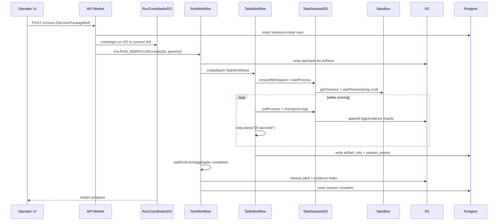
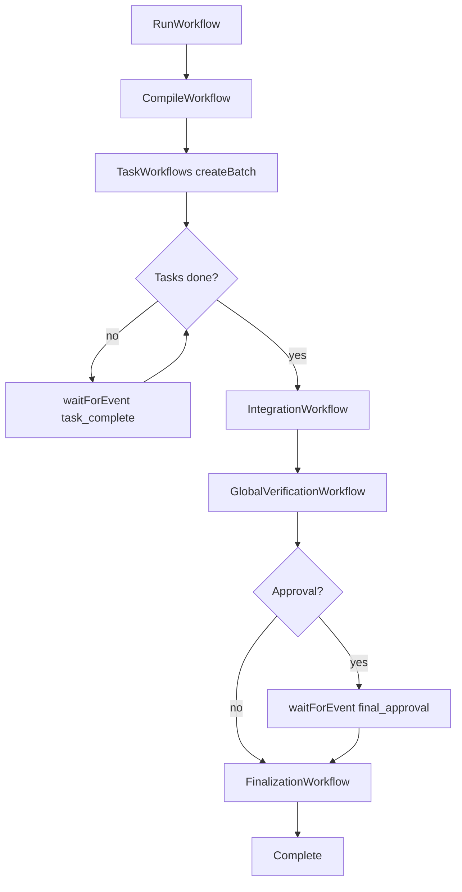

# Building Keystone on Cloudflare Workers, Sandboxes, Workflows, and Neon Postgres via Hyperdrive

## Executive summary

This report proposes a concrete, production-oriented way to build Keystone (a file‑first software‑delivery orchestrator) on entity["company","Cloudflare","internet services company"] Workers + Workflows + Durable Objects + Sandboxes + R2 + Queues, using entity["company","Neon","serverless postgres company"] Postgres as the minimal operational core via Hyperdrive.

The core architectural bet is: **treat R2 + repo files as the system of record for workflow meaning and evidence**, and treat Postgres as a small **operational index** (sessions/events/approvals/workspace bindings/leases/artifact refs). This aligns with Cloudflare’s own Workflows guidance: steps are retryable, step outputs have limits, and large state should be stored externally (for example, in R2) with references retained in durable state. citeturn10view0

For “must run over an hour,” the reliable model is: **Workflows orchestrate long‑running runs**, but do not try to hold a single step in active CPU for an hour. Instead, run long commands as **Sandbox background processes** (`startProcess`) and make Workflows durable via **short, idempotent steps** that start/poll/checkpoint/sleep. Workflows can sleep for “1 hour” and beyond, and can persist state for hours/weeks, while CPU time is limited per invocation (default ~30s, configurable up to 5 minutes). citeturn15search14turn10view1turn13search2

Local development is achievable end‑to‑end: Workers + Durable Objects + Workflows can be run locally via `wrangler dev` (Workflows are emulated), Hyperdrive supports a `localConnectionString` to connect directly to a remote Neon DB over TLS during local dev, and Sandbox SDK provides a local workflow where `wrangler dev` builds/uses your Docker image for sandbox execution. citeturn3search2turn3search0turn12view0

## Reference architecture and interactions

### Component diagram

```mermaid
flowchart LR
  UI[Operator UI\n(web/desktop)] -->|HTTPS| API[Keystone API Worker\n(Workers)]
  UI <-->|WebSocket| RC[RunCoordinatorDO\n(Durable Object)]

  API -->|create instance| RW[RunWorkflow\n(Workflows)]
  RW --> CW[CompileWorkflow]
  RW --> TW[TaskWorkflow\n(one per task)]
  RW --> IW[IntegrationWorkflow]
  RW --> GV[GlobalVerificationWorkflow]
  RW --> FZ[FinalizationWorkflow]

  subgraph Coordination
    RC
    TS[TaskSessionDO]
    TC[TenantControlDO]
    WH[WebhookInboxDO]
  end

  subgraph Data
    PG[(Neon Postgres\nvia Hyperdrive)]
    R2[(R2 artifacts/evidence)]
  end

  subgraph Execution
    SB[Sandbox SDK\nLinux FS + processes]
  end

  API --> PG
  RW --> PG
  CW --> R2
  TW --> SB
  SB --> R2

  API --> Q[Queues]
  Q --> QC[Queue consumer Worker]

  API --> AIG[AI Gateway]
  AIG --> LLM[Providers\n(+ Workers AI)]
```

Cloudflare Workflows are designed for durable, multi‑step execution with retries, sleeping, and waiting for external events/approvals, and can persist state for “minutes, hours, or even weeks.” citeturn15search3  
Durable Objects provide a single‑threaded, globally addressable compute+storage primitive well suited to coordination (run hubs / task hubs / quota gates). citeturn6search15turn6search21

### Run lifecycle sequence (happy path)



This is consistent with Workflows best practices: keep steps granular, idempotent, and avoid side effects outside `step.do`. citeturn11view0turn16view1

## Services used and where each fits

| Cloudflare service | Keystone role | Notes / constraints |
|---|---|---|
| Workers | API + orchestration triggers + policy enforcement | Workers provide the primary HTTP surface; use vars/secrets correctly. citeturn8search0turn8search7 |
| Durable Objects (and optional Agents SDK) | Real-time run/task coordination, WebSockets, quotas | DOs are single-threaded and strongly consistent; excellent for coordination. citeturn6search15turn6search21 Agents SDK can be used as a convenience layer (agents run on DO). citeturn6search4 |
| Workflows | Durable orchestration layer | Steps retry; state can persist for hours/weeks; CPU time is capped per invocation. citeturn15search3turn10view1 |
| Sandboxes (Sandbox SDK) | Filesystem + process execution for repo work | Provides exec/stream/background processes, git helpers, backups. citeturn4search14turn4search6turn5search3turn5search0turn4search3 |
| R2 | Artifact & evidence store | Use for large outputs; Workflows explicitly recommend storing large step outputs externally (example: R2). citeturn10view0turn0search18 |
| Queues | Async fanout, housekeeping, webhook buffering | Queues have a local dev story and can decouple side effects. citeturn7search24turn3search36 |
| Hyperdrive | Workers ↔ Postgres connectivity | Provides pooling and optional query caching; local dev uses `localConnectionString`. citeturn13search8turn3search0turn13search1 |
| AI Gateway | LLM gateway + observability + routing | OpenAI‑compatible chat completions endpoint; central place for logging/caching/rate limiting. citeturn1search0turn1search1turn7search13 |
| Workers AI | Optional on-network inference | Use for low-cost / low-latency tasks; can be routed behind AI Gateway. citeturn1search4turn6search20 |

## Minimal operational core schema and artifact layout

### File-first storage model

The file-first principle is implemented operationally as:

- **R2 (and repo files)**: plan/task/evidence truth.
- **Postgres**: operational indexing + locks + approvals + artifact *references*.

Cloudflare Workflows explicitly recommends storing large step outputs externally (e.g., R2) and returning a reference when step output would exceed limits. citeturn10view0

### R2 key patterns

These keys are designed to be deterministic, tenant-scoped, and friendly to audits:

- `tenants/{tenant_id}/runs/{run_id}/inputs/decision-package/{artifact_id}.json`
- `tenants/{tenant_id}/runs/{run_id}/plan/plan.json`
- `tenants/{tenant_id}/runs/{run_id}/tasks/{task_id}/handoff.json`
- `tenants/{tenant_id}/runs/{run_id}/tasks/{task_id}/logs/{attempt_id}.jsonl`
- `tenants/{tenant_id}/runs/{run_id}/tasks/{task_id}/evidence/{attempt_id}/index.json`
- `tenants/{tenant_id}/runs/{run_id}/integration/{integration_id}/merge-report.json`
- `tenants/{tenant_id}/runs/{run_id}/release/release-pack.zip`
- `tenants/{tenant_id}/sandboxes/{sandbox_id}/backups/{backup_id}.squashfs`

If you use sandbox backups, Sandbox SDK states backups are created as compressed squashfs archives uploaded to R2 via presigned URLs, and restores are copy-on-write overlays that can be re-restored after sleep/restart. citeturn5search0turn5search1

### Postgres DDL for the minimal operational core

The schema below is intentionally minimal and keeps artifact bodies out of SQL.

```sql
CREATE TABLE IF NOT EXISTS sessions (
  tenant_id           uuid        NOT NULL,
  session_id          uuid        PRIMARY KEY,
  run_id              text        NOT NULL,
  session_type        text        NOT NULL,          -- run|compile|task|integration|global_verify|finalize
  status              text        NOT NULL,          -- queued|running|waiting|complete|failed|cancelled
  parent_session_id   uuid        NULL,
  created_at          timestamptz NOT NULL DEFAULT now(),
  updated_at          timestamptz NOT NULL DEFAULT now(),
  metadata            jsonb       NOT NULL DEFAULT '{}'::jsonb
);

CREATE INDEX IF NOT EXISTS idx_sessions_tenant_run
  ON sessions (tenant_id, run_id);

CREATE TABLE IF NOT EXISTS session_events (
  tenant_id        uuid        NOT NULL,
  event_id         uuid        PRIMARY KEY,
  session_id       uuid        NOT NULL REFERENCES sessions(session_id) ON DELETE CASCADE,
  run_id           text        NOT NULL,
  task_id          text        NULL,
  event_type       text        NOT NULL,
  severity         text        NOT NULL DEFAULT 'info',
  ts              timestamptz NOT NULL DEFAULT now(),
  idempotency_key  text        NULL,                 -- dedupe for retries/replays
  artifact_ref_id  uuid        NULL,                 -- pointer to artifact_refs
  payload          jsonb       NOT NULL DEFAULT '{}'::jsonb
);

CREATE INDEX IF NOT EXISTS idx_session_events_tenant_session_ts
  ON session_events (tenant_id, session_id, ts);

CREATE UNIQUE INDEX IF NOT EXISTS uq_session_events_idempo
  ON session_events (tenant_id, session_id, idempotency_key)
  WHERE idempotency_key IS NOT NULL;

CREATE TABLE IF NOT EXISTS approvals (
  tenant_id        uuid        NOT NULL,
  approval_id      uuid        PRIMARY KEY,
  run_id           text        NOT NULL,
  session_id       uuid        NOT NULL REFERENCES sessions(session_id) ON DELETE CASCADE,
  approval_type    text        NOT NULL,
  status           text        NOT NULL,             -- pending|approved|rejected|cancelled|expired
  requested_by     text        NULL,
  requested_at     timestamptz NOT NULL DEFAULT now(),
  resolved_at      timestamptz NULL,
  resolution       jsonb       NULL,
  wait_event_type  text        NULL,                 -- Workflows waitForEvent type
  wait_event_key   text        NULL                  -- stable routing key
);

CREATE INDEX IF NOT EXISTS idx_approvals_tenant_run_status
  ON approvals (tenant_id, run_id, status);

CREATE TABLE IF NOT EXISTS workspace_bindings (
  tenant_id          uuid        NOT NULL,
  binding_id         uuid        PRIMARY KEY,
  run_id             text        NOT NULL,
  session_id         uuid        NOT NULL REFERENCES sessions(session_id) ON DELETE CASCADE,
  task_id            text        NULL,
  sandbox_id         text        NOT NULL,          -- enforce <=63 chars in app logic
  repo_url           text        NOT NULL,
  repo_ref           text        NOT NULL,          -- commit SHA / branch
  worktree_path      text        NOT NULL,          -- e.g. /workspace/task-123
  branch_name        text        NOT NULL,          -- e.g. run/<run_id>/<task_id>
  created_at         timestamptz NOT NULL DEFAULT now(),
  updated_at         timestamptz NOT NULL DEFAULT now(),
  metadata           jsonb       NOT NULL DEFAULT '{}'::jsonb
);

CREATE UNIQUE INDEX IF NOT EXISTS uq_workspace_binding
  ON workspace_bindings (tenant_id, run_id, session_id);

CREATE TABLE IF NOT EXISTS worker_leases (
  tenant_id         uuid        NOT NULL,
  lease_id          uuid        PRIMARY KEY,
  lease_type        text        NOT NULL,           -- sandbox_slot|task_slot|integration_slot|...
  lease_key         text        NOT NULL,           -- deterministic
  owner_session_id  uuid        NOT NULL REFERENCES sessions(session_id) ON DELETE CASCADE,
  acquired_at       timestamptz NOT NULL DEFAULT now(),
  expires_at        timestamptz NOT NULL,
  heartbeat_at      timestamptz NOT NULL DEFAULT now(),
  metadata          jsonb       NOT NULL DEFAULT '{}'::jsonb
);

CREATE UNIQUE INDEX IF NOT EXISTS uq_worker_lease_key
  ON worker_leases (tenant_id, lease_type, lease_key);

CREATE TABLE IF NOT EXISTS artifact_refs (
  tenant_id        uuid        NOT NULL,
  artifact_ref_id  uuid        PRIMARY KEY,
  run_id           text        NOT NULL,
  session_id       uuid        NULL REFERENCES sessions(session_id) ON DELETE SET NULL,
  task_id          text        NULL,
  kind             text        NOT NULL,            -- plan|handoff|log|evidence|patch|release_pack|...
  storage_backend  text        NOT NULL,            -- r2|external
  storage_uri      text        NOT NULL,            -- r2://bucket/key or https://...
  content_type     text        NOT NULL,
  sha256           text        NULL,
  size_bytes       bigint      NULL,
  created_at       timestamptz NOT NULL DEFAULT now(),
  metadata         jsonb       NOT NULL DEFAULT '{}'::jsonb
);

CREATE INDEX IF NOT EXISTS idx_artifact_refs_tenant_run
  ON artifact_refs (tenant_id, run_id);
```

### Hyperdrive + Neon connectivity (prod and local)

Hyperdrive handles connection pooling and (optional) query caching, and documents how placement near the DB can reduce multi-query request latency. citeturn13search8turn13search1  
For local dev: `wrangler dev` uses `localConnectionString` (or the corresponding env var) to connect directly to a local or remote DB; Hyperdrive cache/pooling do not apply in this mode. citeturn3search0

## Durable Objects: classes, responsibilities, and TypeScript signatures

Durable Objects are explicitly positioned for coordination, collaboration, and stateful systems; they are single-threaded and strongly consistent. citeturn6search15turn6search21

### Responsibilities

- **RunCoordinatorDO**: run-scoped coordination, UI WebSocket fanout, compact run summary, progress events.
- **TaskSessionDO**: per-task attempt supervisor: sandbox/workspace lifecycle, log streaming, background process polling.
- **TenantControlDO**: per-tenant quotas/concurrency gates; issues and renews leases.
- **WebhookInboxDO**: ingestion+dedupe for provider webhooks; forwards to Workflows (`sendEvent`) or Queues.

### DO method signatures (TypeScript)

```ts
// Shared types (abbrev)
export type RunId = string;     // ULID/UUID string
export type TaskId = string;
export type TenantId = string;

export type ArtifactRef = {
  artifactRefId: string;
  kind: string;
  uri: string;     // r2://bucket/key (your convention)
  sha256?: string;
  sizeBytes?: number;
  contentType: string;
};

export type SessionEventInput = {
  tenantId: TenantId;
  runId: RunId;
  sessionId: string;
  taskId?: TaskId;
  eventType: string;
  severity?: "info" | "warn" | "error";
  idempotencyKey?: string;
  artifact?: ArtifactRef;
  payload?: Record<string, unknown>;
};

export class RunCoordinatorDO {
  // WebSocket hub for operators
  async fetch(req: Request): Promise<Response>; // routes: /ws, /summary, /append-event, /approval/*
  // internal helpers
  private async handleWebSocket(req: Request): Promise<Response>;
  private async appendEvent(evt: SessionEventInput): Promise<void>;
  private async getSummary(): Promise<Response>;
}

export class TaskSessionDO {
  async fetch(req: Request): Promise<Response>; // routes: /ensure-workspace, /start-process, /poll, /commit, /teardown
}

export class TenantControlDO {
  async fetch(req: Request): Promise<Response>; // routes: /acquire-lease, /heartbeat, /release, /limits
}

export class WebhookInboxDO {
  async fetch(req: Request): Promise<Response>; // routes: /ingest/<provider>
}
```

Keep Durable Objects focused on **coordination and streaming**; the durable truth remains Postgres (operational) + R2 (artifacts). This keeps the system resilient to DO restarts and aligns with Workflows’ “don’t rely on state outside a step” guidance at the orchestration layer. citeturn16view2turn10view2

## Workflows: classes, step boundaries, and retry/idempotency patterns

### Workflows programming constraints that matter for Keystone

Cloudflare explicitly documents:

- Steps are individually retryable; therefore steps should ideally be idempotent. citeturn11view0  
- Avoid side effects outside `step.do` because workflow engine restarts can duplicate non-step logic. citeturn16view1  
- Workflows may hibernate and lose in-memory state; do not rely on state outside steps. citeturn16view2  
- Name steps deterministically; step names act as cache keys and help prevent unnecessary reruns. citeturn16view0  
- Event payloads are effectively immutable; durable state must come from step outputs. citeturn10view2  
- Keep large outputs out of step return values; store externally (R2) and return references. citeturn10view0  

### CPU limits and “>1 hour” execution

Workflows share Workers CPU limits; default max CPU time per invocation is 30 seconds, configurable to 5 minutes, and CPU time counts active processing (not time waiting on network/storage I/O). citeturn10view1turn13search2  
Because Keystone’s long work is typically “run commands, stream logs, wait,” the right approach is background sandbox processes + polling steps.

### Workflow classes and step-level responsibilities

Below, each workflow is described as **(a) durable steps** and **(b) idempotency / compensation**.

#### RunWorkflow

Durable responsibilities:
1. `step.do("create session")`: Insert `sessions` row (`session_type=run`), initialize run metadata, create RunCoordinatorDO identity mapping.
2. `step.do("start compile")`: Create CompileWorkflow instance with deterministic ID = `{run_id}:compile`.
3. `step.do("fanout tasks")`: Create task workflow instances (use `createBatch` with deterministic task instance IDs).
4. `step.waitForEvent("task_complete")` loop: Wait for task completions (or poll Postgres) until all required tasks are complete.
5. `step.do("integration")`: Create IntegrationWorkflow.
6. `step.do("global verify")`: Create GlobalVerificationWorkflow.
7. `step.do("finalize")`: Create FinalizationWorkflow.
8. `step.do("mark complete")`: Update session status + publish release pack artifact ref.

Idempotency patterns:
- Use deterministic instance IDs (per-run/per-task). `createBatch` is documented as idempotent with respect to existing instances within retention. citeturn15search0turn15search6
- Record a “phase completed” event with a unique `idempotency_key` in `session_events`; if a step retries, you can check that key and short‑circuit.

Compensation:
- Always emit a terminal status (failed/cancelled) and release leases via TenantControlDO or a cleanup Queue message.

#### CompileWorkflow

Steps:
1. `step.do("load inputs")`: read DecisionPackage artifact ref (R2) and any repo pointers.
2. `step.do("repo scan")`: create/use a compile sandbox session to scan / index relevant code paths (fast; no long tasks).
3. `step.do("plan via LLM")`: call AI Gateway for plan/task generation; write plan + task list as artifacts to R2; return artifact refs.
4. `step.do("emit tasks")`: for each task, write `handoff.json` artifact.

Idempotency:
- LLM calls must be guarded by step determinism and/or a pre-check: if plan artifact exists at deterministic key (`tenants/.../runs/.../plan/plan.json`), return it instead of regenerating.
- Keep step names deterministic and derived from stable inputs (run_id, task_id). citeturn16view0turn10view0

Compensation:
- On planning failure, raise an approval/event to downgrade to human‑edited task list (optional); Workflows can wait for human input using `waitForEvent`. citeturn10view2turn2search31

#### TaskWorkflow

This is the core “>1 hour” engine.

Steps:
1. `step.do("acquire lease")`: ask TenantControlDO to acquire a task slot + sandbox slot lease; persist lease IDs in Postgres.
2. `step.do("ensure workspace")`: TaskSessionDO provisions sandbox + worktree binding; clones repo if missing (Sandbox SDK supports git workflows). citeturn5search3
3. `step.do("start impl process")`: TaskSessionDO starts long-running process via `startProcess` (implementation agent or scripted steps). citeturn4search2turn4search10
4. `step.do("poll")`: poll process status + append logs to R2; emit session_events + update RunCoordinatorDO for realtime UI.
5. `step.sleep("backoff", "30 seconds")`: repeat poll until completion. Workflows show `step.sleep("1 hour")` usage. citeturn15search14
6. `step.do("reviewers")`: run reviewer LLM calls (via AI Gateway) using repo diffs and structured handoffs stored in R2.
7. `step.do("validation")`: run tests/linters in sandbox; treat as background process if long.
8. `step.do("commit and artifactize")`: commit changes, generate patch/test summaries, store artifacts in R2, insert artifact_refs.
9. `step.do("release lease")`: release via TenantControlDO even if partial success.

Idempotency:
- Use a per-iteration “attempt_id” (ULID) and deterministic artifact keys under `.../attempts/{attempt_id}/...`; if retry replays, check if the attempt already produced “attempt.complete” event idempotency key.
- Never do external side effects (git push, creating PRs, posting comments) without a pre-check (already done?) because steps retry. citeturn11view0turn16view1

Compensation:
- On failure, `step.do("cleanup")` enqueues a Queue message to tear down sandbox/workspace and release leases (so cleanup doesn’t block task failure completion).
- If an impl process is still running on failure, TaskSessionDO kills it (`killProcess`) and then destroys sandbox. citeturn4search6turn4search3

#### IntegrationWorkflow

Steps:
1. `step.do("ensure parent completions")`: confirm required parent task workflows complete (via event aggregation or DB check).
2. `step.do("merge")`: use sandbox git operations to merge task branches into integration baseline.
3. `step.do("conflict handling")`: if conflicts, write conflict artifact + create a follow-up TaskWorkflow (“merge resolution”) or raise approval.
4. `step.do("persist artifacts")`: write merge report/diff/test outputs to R2 + artifact_refs.

Idempotency:
- Deterministic integration baseline branch name, e.g. `integrations/run/<run_id>/<group_id>`.
- Deterministic output keys for merge report; if present, reuse.

#### GlobalVerificationWorkflow

Steps:
1. `step.do("start global tests")`: `startProcess` in a “verification sandbox” (could reuse integration baseline sandbox).
2. `step.do("poll+checkpoint")` loop + sleeps.
3. `step.do("defect to tasks")`: if failures, emit follow-up tasks as artifacts and create TaskWorkflows.

#### FinalizationWorkflow

Steps:
1. `step.do("assemble release evidence")`: create release pack (zip or JSON index) in R2.
2. `step.waitForEvent("final_approval")` if policy demands human approval.
3. `step.do("merge")`: push final changes to default branch, or create PR (depending product policy).
4. `step.do("mark complete")`: status updates + final artifact refs.

### Workflow mermaid flowchart (summary)



Cloudflare documents that Workflows can wait for events via `step.waitForEvent()` and that events can be sent via bindings or REST APIs; events are immutable and must not be mutated for persistence. citeturn10view2

## Sandbox lifecycle, local dev, and API usage

### Sandbox lifecycle and key APIs

Sandbox SDK provides lifecycle + command APIs:

- Lifecycle: `getSandbox()`, `setKeepAlive()`, `destroy()`. citeturn4search3turn4search7
- Commands: `exec()`, `execStream()`, `startProcess()`, `listProcesses()`, `killProcess()`. citeturn4search6turn4search2
- Git workflows: `gitCheckout()` and related helpers. citeturn5search3
- Snapshotting via backups: `createBackup()` / `restoreBackup()`, stored in R2. citeturn5search0turn5search1turn5search4

### Local sandbox execution is supported (Docker-backed)

The Sandbox “Getting started” guide documents **local testing** with `npm run dev` / `wrangler dev` and notes that the first run builds the Docker container (2–3 minutes), with subsequent runs faster due to caching. citeturn12view0  
This is critical: Keystone’s local mode can include real sandbox execution, not a stub.

### Outbound traffic and secret isolation from sandbox

Sandbox SDK supports outbound handlers (programmable egress proxies) that run on the same machine as the sandbox and have access to Workers bindings; you can block methods/hosts and inject credentials at egress. citeturn5search2  
For Keystone, this is the enforcement point for capability-based network access.

## API surface: Worker endpoints and Maestro APIs (with example JSON)

### Public Worker API endpoints (suggested)

Keep the API surface “workflow-first” (runs, tasks, approvals, events). These are representative; adapt to your product.

| Endpoint | Purpose |
|---|---|
| `POST /v1/runs` | Create run + start RunWorkflow |
| `GET /v1/runs/{run_id}` | Fetch run summary (from Postgres + RunCoordinatorDO snapshot) |
| `GET /v1/runs/{run_id}/ws` | WebSocket upgrade to RunCoordinatorDO |
| `POST /v1/runs/{run_id}/approvals/{approval_id}/resolve` | Resolve approval; sends Workflows event |
| `POST /v1/webhooks/{provider}` | Webhook intake → WebhookInboxDO |
| `POST /v1/tasks/{task_id}/debug/exec` | (admin) run a sandbox exec for debugging |

Example payload: create run

```json
{
  "tenant_id": "b8a5a8f2-87f4-4f0e-a92b-8f1b9b94a9b3",
  "repo": {
    "url": "https://github.com/acme/my-repo",
    "ref": "main"
  },
  "decision_package": {
    "artifact_ref": {
      "kind": "decision_package",
      "storage_backend": "r2",
      "storage_uri": "r2://keystone-artifacts/tenants/.../runs/.../inputs/decision-package/dp.json",
      "content_type": "application/json",
      "sha256": "..."
    }
  },
  "policy": {
    "require_merge_approval": true,
    "network": "deny_by_default"
  }
}
```

Example payload: resolve approval

```json
{
  "tenant_id": "b8a5a8f2-87f4-4f0e-a92b-8f1b9b94a9b3",
  "resolution": "approved",
  "data": {
    "notes": "Proceed",
    "constraints": {
      "no_new_dependencies": true
    }
  }
}
```

Events then flow into Workflows via `sendEvent`/bindings; Workflows supports `waitForEvent` for human-in-the-loop patterns. citeturn10view2turn2search31

### Maestro internal API (kernel APIs used by Keystone)

Maestro is best implemented as an internal TypeScript library in the Worker repo (not necessarily a separate service initially) that wraps Cloudflare primitives.

```ts
export interface Maestro {
  sessions: {
    createRunSession(input: { tenantId: string; runId: string }): Promise<{ sessionId: string }>;
    updateStatus(input: { tenantId: string; sessionId: string; status: string }): Promise<void>;
  };

  events: {
    append(evt: SessionEventInput): Promise<void>;        // writes Postgres + optional R2 shard
    stream(runId: string): AsyncIterable<SessionEventInput>; // via DO WebSocket
  };

  approvals: {
    request(req: { tenantId: string; runId: string; sessionId: string; type: string; payload: any }): Promise<{ approvalId: string }>;
    resolve(req: { tenantId: string; approvalId: string; resolution: any }): Promise<void>;
  };

  leases: {
    acquire(req: { tenantId: string; leaseType: string; leaseKey: string; ownerSessionId: string }): Promise<{ leaseId: string }>;
    release(req: { tenantId: string; leaseId: string }): Promise<void>;
  };

  artifacts: {
    put(req: { tenantId: string; runId: string; kind: string; key: string; bytes: Uint8Array; contentType: string }): Promise<ArtifactRef>;
    link(ref: ArtifactRef, session: { sessionId: string; taskId?: string }): Promise<void>; // inserts artifact_refs
  };

  sandbox: {
    ensureWorkspace(req: EnsureWorkspaceRequest): Promise<WorkspaceBinding>;
    startProcess(req: StartProcessRequest): Promise<{ processId: string }>;
    poll(req: PollProcessRequest): Promise<ProcessStatus>;
    backup(req: { sandboxId: string; dir: string }): Promise<{ backupId: string }>;
    teardown(req: { sandboxId: string }): Promise<void>;
  };
}
```

These abstractions help keep a migration path to Temporal straightforward because the artifact model and the kernel APIs remain stable.

## Security and capability policy model

### Secrets handling in Workers

Cloudflare documents that secrets are environment variables whose values are not visible after being set; sensitive values should be kept as secrets (not plain vars). citeturn8search7turn8search3

Design rules:
- Sandboxes never receive raw provider tokens (git host tokens, cloud API keys).
- Workers hold secrets and grant access via outbound proxy handlers or signed URLs.

### Sandbox egress policy = capability enforcement

Use outbound handlers to implement:
- `network.none` default for tasks unless explicitly allowed.
- allow-list per host (git host, package registries, docs).
- inject credentials at egress (Worker adds Authorization headers), never expose secrets inside sandbox. citeturn5search2turn5search5

### Capability policy model (practical)

Define a small, stable capability set (stored in Postgres session metadata or policy artifacts):

- `fs.read`, `fs.write`
- `process.exec`, `process.background`
- `git.read`, `git.write`
- `net.http`, `net.https`, `net.host_allowlist`
- `artifact.read`, `artifact.write`
- `approval.required` (for merge/network/production ops)

Policy enforcement points:
- API Worker (authZ)
- TenantControlDO (rate/quotas)
- Sandbox outbound handler (network)
- Workflows step guards (approval gates)

## Multi-tenancy enforcement

A robust multi-tenant approach on this stack:

1. **Authentication → tenant resolution** at the Worker edge.
2. Every Postgres mutation includes `tenant_id` predicate.
3. R2 keys are tenant-prefixed; never accept arbitrary `key` from clients without tenant guard.
4. DO IDs include tenant_id to prevent cross-tenant routing errors.
5. TenantControlDO enforces per-tenant concurrency (sandboxes, tasks, LLM budget).

If you front the Worker with Cloudflare Access, Cloudflare documents how to validate the Access JWT header (`Cf-Access-Jwt-Assertion`) in Workers for defense-in-depth. citeturn8search1

## Monitoring, observability, and ops (local dev, staging, production)

### Observability primitives

- Workers Logs (dashboard) provides log collection and query. citeturn7search10
- `wrangler tail` streams logs in real time. citeturn7search11
- Workers Logpush exports trace event logs to destinations. citeturn7search2
- Workers Analytics Engine supports unlimited-cardinality analytics and can power usage-based billing. citeturn7search1

### Environment separation

Use Wrangler environments (`dev`, `staging`, `production`) to isolate bindings and vars. citeturn8search4turn7search15  
Do not share a production Hyperdrive config in local dev unless you intentionally choose `wrangler dev --remote`.

### Local dev support for every piece

This is the key addition you asked for: “must be able to run locally.”

| Component | Local dev status | How |
|---|---|---|
| Workers API | Yes | `wrangler dev` runs locally. citeturn3search28turn7search3 |
| Durable Objects | Yes | DOs run under `wrangler dev` / Miniflare. citeturn3search10 |
| Workflows | Yes (emulated) | Workflows local development via Wrangler; manage with `wrangler workflows --local`. citeturn3search2turn3search24turn3search13 |
| Hyperdrive→Neon | Yes (direct connect) | Configure `localConnectionString` / env var; Hyperdrive caching/pooling not active locally. citeturn3search0 |
| Sandboxes | Yes (Docker-backed local) | Sandbox SDK local test builds Docker image and runs via `npm run dev`. citeturn12view0 |
| R2 | Typically emulated or use real R2 | Wrangler simulates some storage bindings; if you need real R2 semantics, use a dev bucket. (For large artifacts, dev bucket is usually fine.) citeturn4search15turn7search2 |
| Queues | Yes | Queues local development supported. citeturn3search36 |
| AI Gateway | Remote | Call AI Gateway endpoint from local worker (requires credentials); logpush available. citeturn1search0turn7search13 |

## Local development: concrete commands

### Workers + Workflows local

Workflows local dev is explicitly supported via Wrangler, and as of April 1, 2026, Wrangler supports `--local` for Workflows commands targeting your dev session. citeturn3search2turn3search13

```bash
# start local worker (Workers + DOs + Workflows emulator)
npx wrangler dev

# in another terminal (same machine)
npx wrangler workflows list --local
npx wrangler workflows trigger run-workflow --local --params '{"runId":"01J...","tenantId":"..."}'
npx wrangler workflows instances list run-workflow --local
```

### Hyperdrive local connection to Neon

Hyperdrive local development supports connecting to remote DBs over TLS via `localConnectionString` or the env var `CLOUDFLARE_HYPERDRIVE_LOCAL_CONNECTION_STRING_<BINDING>`. citeturn3search0turn3search3

```bash
export CLOUDFLARE_HYPERDRIVE_LOCAL_CONNECTION_STRING_HYPERDRIVE="postgresql://...?...sslmode=require"
npx wrangler dev
```

### Sandbox SDK local

Sandbox SDK “Getting started” documents local testing via `npm run dev`, with Docker building the image on first run. citeturn12view0

```bash
# ensure Docker is running, then:
npm run dev
curl http://localhost:8787/run
curl http://localhost:8787/file
```

### Neon CLI (optional but useful)

Neon documents CLI commands to generate connection strings (including `sslmode=require`) and manage branches. citeturn14search4turn14search1

```bash
# install neonctl (one option)
npm i -g neonctl

# get a connection string for a branch
neon connection-string mybranch --psql
```

## Migration path to Temporal

If you later need stronger orchestration semantics (workflow querying, richer message handling, or portability), migrate the orchestrator while keeping the kernel and artifact model stable.

- Temporal’s workflow message passing includes Signals, Queries, and Updates as first-class concepts. citeturn9search4turn9search0
- Temporal Cloud is a managed durable execution platform; self-host deployment guidance exists if needed. citeturn9search1turn9search3

Mapping recommendation:

| Keystone construct | Cloudflare Workflows | Temporal |
|---|---|---|
| Durable orchestrator | Workflows | Temporal Workflow |
| Durable step / external I/O | `step.do` | Activity |
| Wait for human/webhook | `step.waitForEvent` | Signal / Update |
| Sleep/backoff | `step.sleep` | Timer |
| Artifact refs model | R2 + artifact_refs | unchanged |

The main code you rewrite is the orchestration layer; keep (1) R2 artifact conventions, (2) Postgres operational schema, and (3) Maestro APIs stable.

## M1 implementation plan (tasks, services, acceptance criteria)

### M1 goal

Prove that Keystone can run **a real repo change end‑to‑end**, with **durable orchestration**, **hour+ execution capability**, **file-first artifacts in R2**, and full local development support.

### M1 work breakdown

| Workstream | Concrete tasks | Cloudflare services | Acceptance criteria |
|---|---|---|---|
| Core API + tenancy | Implement JWT/tenant extraction + guards; `POST /v1/runs`; `GET /v1/runs/{id}` | Workers | Requests without tenant rejected; all DB writes scoped by tenant_id. citeturn8search7turn8search1 |
| Operational core DB | Apply DDL; implement minimal DAL with Hyperdrive binding | Hyperdrive + Neon | Local dev connects using `localConnectionString`; production connects via Hyperdrive binding. citeturn3search0turn3search4turn14search0 |
| Realtime coordination | RunCoordinatorDO + WebSocket endpoint; push progress events | Durable Objects | UI receives progress over WS; run summary can be reconstructed from DB+R2. citeturn6search15turn6search0 |
| Workflows skeleton | Implement RunWorkflow + TaskWorkflow first; local Workflows testing via `--local` | Workflows | `wrangler workflows trigger --local` starts a run; steps persist across restarts. citeturn3search2turn3search13turn10view0 |
| Sandbox execution | Build sandbox image with git+runtime; TaskSessionDO uses `gitCheckout`, `startProcess`, poll, `destroy` | Sandboxes | Local `npm run dev` runs sandbox commands; task can run >1h via background process + polling sleep loop. citeturn12view0turn4search2turn4search10turn15search14 |
| Artifacts | Implement R2 keys + artifact_refs writes; log sharding to R2 | R2 | Every run produces plan.json, logs.jsonl, release pack; DB stores refs only. citeturn10view0turn0search18 |
| LLM plumbing | AI Gateway integration, with a provider, plus optional Workers AI | AI Gateway + Workers AI | CompileWorkflow can call LLM and save outputs; model calls observable in gateway logs. citeturn1search0turn7search13turn1search4 |
| Security gating | Sandbox outbound handler denies by default; allow-list + approvals for net | Sandboxes + Workflows | Any outbound call blocked unless policy permits; optionally requires approval event. citeturn5search2turn10view2 |
| Ops/observability | Enable Workers Logs; add `wrangler tail` runbook; minimal metrics | Workers Logs + Analytics Engine | You can debug failures locally and in staging via logs; basic run success/failure metrics recorded. citeturn7search10turn7search1turn7search11 |

### M1 checklist (implementation)

1. Repo scaffold: `wrangler.jsonc` includes Workflows binding, DO bindings, Hyperdrive binding (with localConnectionString), R2 bucket binding, Sandbox DO binding.
2. Postgres DDL applied to Neon branch.
3. API Worker routes exist: create run, fetch summary, resolve approval, websocket route.
4. RunCoordinatorDO streams events; TaskSessionDO manages sandbox exec.
5. RunWorkflow triggers CompileWorkflow and TaskWorkflows via deterministic IDs (`createBatch` for tasks).
6. TaskWorkflow uses `startProcess` + polling + `step.sleep` loop; artifacts go to R2; refs go to Postgres.
7. Local dev script set:
   - `npm run dev` starts worker + sandbox locally (Docker build happens first run).
   - `wrangler workflows trigger --local` works.
   - Hyperdrive local env var points at Neon TLS connection string.
8. Observability:
   - local console logs,
   - staging `wrangler tail`,
   - event shards in R2 for postmortems.
9. Security:
   - outbound handler denies by default,
   - allow-list for necessary hosts.

If you deliver this M1, you’ll have proven the hard parts: durable orchestration, long-running execution, deterministic artifacts, and full local development.