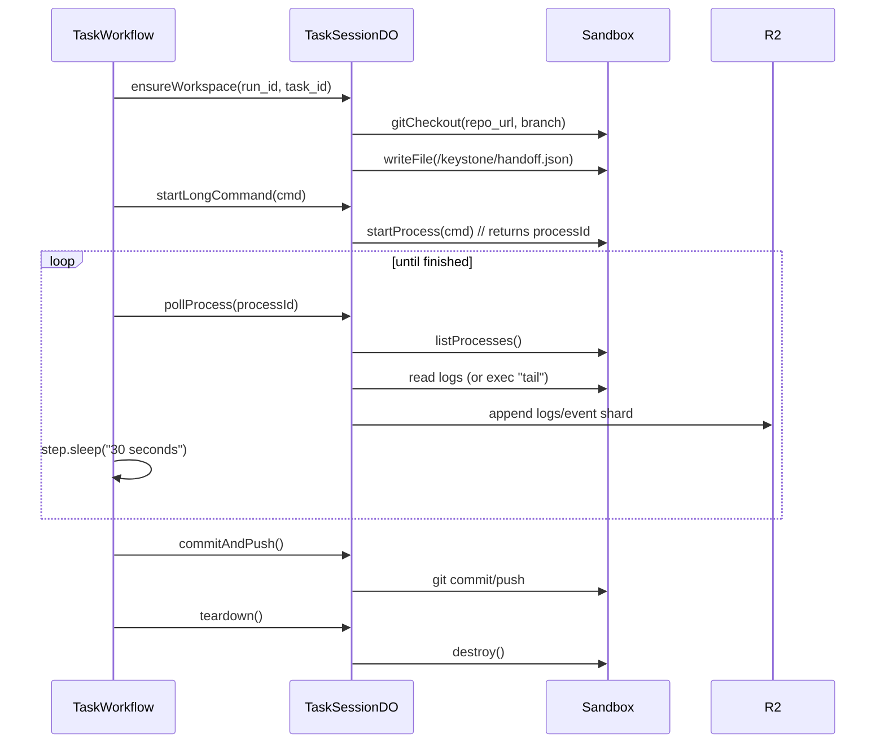

# Building Keystone on Cloudflare Workers, Sandboxes, Workflows, and Neon Postgres via Hyperdrive

## Executive summary

Keystone’s “file‑first software‑delivery orchestrator” shape (durable control plane + isolated execution + artifact/evidence as the primary output) maps unusually well to the Cloudflare platform: **Workflows** give durable, multi-step execution that can run for *hours/days/weeks* with sleep/event waits, **Durable Objects** give strongly consistent coordination and real-time UI state, and **Sandboxes** provide isolated Linux containers with a filesystem and process model suitable for repo work (git, builds, tests), all callable from Workers. citeturn15search3turn6search15turn4search7turn0search30

For Keystone’s “>1 hour execution” requirement, the robust pattern is: **Workflows orchestrate long runs**, but **each step stays under CPU limits** by (a) using Sandbox *background processes* for long commands, and (b) polling/checkpointing via short steps + `sleep` or `waitForEvent` rather than one giant step. Cloudflare explicitly frames Workflows as durable steps (retryable), supports hour/day sleeps, and allows waiting for external events in-flight. citeturn15search3turn15search14turn10view2

Neon (serverless Postgres) + Hyperdrive is a good operational core: Hyperdrive provides connection pooling placed near the DB and optional query caching, and it supports local development via a `localConnectionString` for `wrangler dev` (no Hyperdrive pooling/caching locally unless you run remote mode). For Hyperdrive+Neon specifically, Cloudflare recommends using a “direct” Postgres driver (for example `pg` or Postgres.js) when routing through Hyperdrive. citeturn3search0turn2search2turn0search9turn14search23

Your desired “relaxed” / evolvable model—keep artifacts and plan details *out* of the relational schema and store only references—fits Cloudflare Workflows best practices too: step outputs have size limits, and Cloudflare explicitly suggests storing large outputs externally (for example, in R2) and persisting references. citeturn10view0turn0file0

## Reference architecture and interaction diagram

The architecture below separates **control plane** (API + orchestration + coordination) from **execution plane** (sandboxed repo work), and makes **R2 the artifact/evidence system-of-record** while Postgres remains a minimal “operational index”.

```mermaid
flowchart LR
  U[Operator UI\n(Tauri/Web)] -->|HTTPS| API[Keystone API Worker\n(HTTP endpoints)]
  U <-->|WebSocket| RCDO[RunCoordinatorDO\n(real-time updates)]

  API -->|create/run| RW[RunWorkflow\n(Workflows)]
  RW --> CW[CompileWorkflow]
  RW --> TW[TaskWorkflow(s)]
  RW --> IW[IntegrationWorkflow]
  RW --> GV[GlobalVerificationWorkflow]
  RW --> FZ[FinalizationWorkflow]

  subgraph Coordination
    RCDO
    TCDO[TenantControlDO\nquotas/concurrency]
    TSDO[TaskSessionDO\nsandbox+task state]
    WHDO[WebhookInboxDO\ndedupe+ordering]
  end

  subgraph Storage
    R2[(R2: artifacts/evidence\nsnapshots/logs)]
    PG[(Neon Postgres\nvia Hyperdrive)]
  end

  subgraph Execution
    SB[Sandbox SDK\nLinux container FS+processes]
  end

  API -->|reads/writes| PG
  RW -->|reads/writes| PG
  RW -->|artifact refs| R2
  TW -->|hydrate/exec/poll| SB
  SB -->|mount bucket / backups| R2

  API -->|enqueue| Q[Queues\nasync jobs]
  Q -->|consume| WQ[Queue Consumer Worker]

  API -->|LLM calls| AIG[AI Gateway]
  AIG -->|route to| LLM[LLM providers\n(+ Workers AI)]
```

This design is consistent with Keystone’s product intent: durable orchestration, session-scoped execution containers, task-scoped worktrees, and evidence-first outputs. fileciteturn0file2 citeturn0search30turn15search3turn4search13turn1search7turn1search0

## Cloudflare services and responsibilities

Keystone’s core Cloudflare components (and why each exists):

| Capability | Cloudflare primitive | Keystone use |
|---|---|---|
| API + edge runtime | Workers | REST/JSON API, auth, tenancy enforcement, triggers Workflows, issues R2 signed URLs (if needed), routes WebSockets to DOs. citeturn8search0turn8search7 |
| Durable, long-running orchestration | Workflows | Run-level and task-level durable execution with retries, sleep, and wait-for-event (approvals, webhooks, human decisions). citeturn15search3turn10view2turn15search14 |
| Strong consistency coordination + real-time UI | Durable Objects (or Agents SDK on top) | Run coordinator, per-tenant concurrency gate, per-task session state, webhook inbox/dedup. DOs are single-threaded and provide strongly consistent storage close to compute. citeturn6search15turn6search21turn0search3 |
| “Agent-like” realtime patterns (optional) | Agents SDK | If you want built-in WebSockets/state/scheduling patterns, Agents run on Durable Objects; pair with Workflows for long background work. citeturn6search4turn6search17 |
| Isolated filesystem + processes | Sandboxes (Sandbox SDK) | Session containers + task worktrees; git clone/branch/merge; builds/tests; background processes; sandbox backups (snapshots) and mounted R2 storage. citeturn0search18turn4search6turn4search10turn5search0turn5search3 |
| Artifact store | R2 | File-first artifacts, evidence packs, logs, task outputs, sandbox backups, large Workflow step outputs (store references in PG). R2 is S3-compatible and strongly consistent. citeturn1search10turn10view0 |
| Async fanout & housekeeping | Queues | Fire-and-forget tasks (indexing, notifications, delayed cleanup), decouple latency, reliable delivery semantics. citeturn1search7turn1search3 |
| Postgres connectivity optimization | Hyperdrive | Pooled DB connections near the DB + optional query caching; recommended for Workers → Postgres patterns; supports local dev via `localConnectionString`. citeturn2search2turn3search0turn0search9 |
| LLM request proxy + control plane | AI Gateway | One endpoint (OpenAI-compatible) for multi-provider routing, logging, caching, rate limiting, retry/fallback. citeturn1search12turn1search0turn1search8 |
| On-network inference (optional) | Workers AI | Low-latency inference from Workers, can be called directly or via AI Gateway. citeturn1search9turn1search0 |

Note: Hyperdrive availability and limits can change; Cloudflare’s own pricing docs indicate Hyperdrive is included in Free and Paid plans (Paid adds much higher limits). Some third-party guides may lag behind. citeturn13search0turn13search2turn13search3

## Minimal operational data model and R2 artifact layout

### Design goals

Keystone’s “relaxed” relational model should store only **operational indexing + concurrency locks + approvals**, while artifacts remain **files** (R2) referenced by URIs + hashes. This matches your evolvability goal and maps to Cloudflare Workflows guidance: keep step outputs small; store larger outputs externally and return references. citeturn10view0turn0file0

### R2 key layout patterns

A practical layout that supports auditability, dedupe, and multi-tenancy:

- `tenants/{tenant_id}/runs/{run_id}/decision-package/{artifact_id}.json`
- `tenants/{tenant_id}/runs/{run_id}/plans/{plan_id}.json`
- `tenants/{tenant_id}/runs/{run_id}/events/{yyyy}/{mm}/{dd}/{ulid}.jsonl` (append-only event shards)
- `tenants/{tenant_id}/runs/{run_id}/tasks/{task_id}/handoff.json`
- `tenants/{tenant_id}/runs/{run_id}/tasks/{task_id}/evidence/{activity_id}/conversation.jsonl`
- `tenants/{tenant_id}/runs/{run_id}/tasks/{task_id}/repo/{branch}/patch.diff`
- `tenants/{tenant_id}/sandboxes/{sandbox_id}/backups/{backup_id}.squashfs` (if you persist backups)
- `tenants/{tenant_id}/releases/{run_id}/release-pack/{artifact_id}.zip`

R2 is S3-compatible, strongly consistent, and designed for unstructured data storage; it integrates natively with Workers. citeturn1search10turn1search2

### Neon/Postgres minimal DDL

Below is a minimal operational core schema (as requested). It is intentionally “boring”: mostly keys, timestamps, statuses, and references.

```sql
-- Enable UUID generation if desired (or generate in Worker).
-- CREATE EXTENSION IF NOT EXISTS "uuid-ossp";

CREATE TABLE IF NOT EXISTS sessions (
  tenant_id           uuid        NOT NULL,
  session_id          uuid        PRIMARY KEY,
  run_id              text        NOT NULL,          -- ULID/UUID string
  session_type        text        NOT NULL,          -- run | task | integration | verifier | finalization
  status              text        NOT NULL,          -- queued | running | waiting | complete | failed | cancelled
  parent_session_id   uuid        NULL,
  created_at          timestamptz NOT NULL DEFAULT now(),
  updated_at          timestamptz NOT NULL DEFAULT now(),
  metadata            jsonb       NOT NULL DEFAULT '{}'::jsonb
);

CREATE INDEX IF NOT EXISTS idx_sessions_tenant_run
  ON sessions (tenant_id, run_id);

CREATE TABLE IF NOT EXISTS session_events (
  tenant_id        uuid        NOT NULL,
  event_id         uuid        PRIMARY KEY,
  session_id       uuid        NOT NULL REFERENCES sessions(session_id) ON DELETE CASCADE,
  run_id           text        NOT NULL,
  task_id          text        NULL,
  event_type       text        NOT NULL,             -- step_started | step_completed | sandbox_log | approval_requested | ...
  severity         text        NOT NULL DEFAULT 'info',
  ts              timestamptz NOT NULL DEFAULT now(),
  idempotency_key  text        NULL,                 -- for dedupe on retries
  artifact_ref_id  uuid        NULL,                 -- points to artifact_refs
  payload          jsonb       NOT NULL DEFAULT '{}'::jsonb
);

CREATE INDEX IF NOT EXISTS idx_session_events_tenant_session_ts
  ON session_events (tenant_id, session_id, ts);

CREATE UNIQUE INDEX IF NOT EXISTS uq_session_events_idempo
  ON session_events (tenant_id, session_id, idempotency_key)
  WHERE idempotency_key IS NOT NULL;

CREATE TABLE IF NOT EXISTS approvals (
  tenant_id        uuid        NOT NULL,
  approval_id      uuid        PRIMARY KEY,
  run_id           text        NOT NULL,
  session_id       uuid        NOT NULL REFERENCES sessions(session_id) ON DELETE CASCADE,
  approval_type    text        NOT NULL,             -- decision_request | merge | outbound_network | escalation | ...
  status           text        NOT NULL,             -- pending | approved | rejected | cancelled | expired
  requested_by     text        NULL,                 -- user id/email
  requested_at     timestamptz NOT NULL DEFAULT now(),
  resolved_at      timestamptz NULL,
  resolution       jsonb       NULL,
  wait_event_type  text        NULL,                 -- matches Workflows waitForEvent type
  wait_event_key   text        NULL                  -- stable key used to route event to instance
);

CREATE INDEX IF NOT EXISTS idx_approvals_tenant_run_status
  ON approvals (tenant_id, run_id, status);

CREATE TABLE IF NOT EXISTS workspace_bindings (
  tenant_id          uuid        NOT NULL,
  binding_id         uuid        PRIMARY KEY,
  run_id             text        NOT NULL,
  session_id         uuid        NOT NULL REFERENCES sessions(session_id) ON DELETE CASCADE,
  task_id            text        NULL,
  sandbox_id         text        NOT NULL,           -- Sandbox instance id (<=63 chars per platform constraints; enforce in app)
  repo_url           text        NOT NULL,
  repo_ref           text        NOT NULL,           -- commit SHA or branch
  worktree_path      text        NOT NULL,           -- inside sandbox FS, e.g. /workspace/task-123
  branch_name        text        NOT NULL,           -- e.g. run/<run_id>/<task_id>
  created_at         timestamptz NOT NULL DEFAULT now(),
  updated_at         timestamptz NOT NULL DEFAULT now(),
  metadata           jsonb       NOT NULL DEFAULT '{}'::jsonb
);

CREATE UNIQUE INDEX IF NOT EXISTS uq_workspace_binding
  ON workspace_bindings (tenant_id, run_id, session_id);

CREATE TABLE IF NOT EXISTS worker_leases (
  tenant_id         uuid        NOT NULL,
  lease_id          uuid        PRIMARY KEY,
  lease_type        text        NOT NULL,            -- sandbox | task_slot | integration_slot | llm_budget | ...
  lease_key         text        NOT NULL,            -- e.g. "tenant/<id>/sandbox/<sid>"
  owner_session_id  uuid        NOT NULL REFERENCES sessions(session_id) ON DELETE CASCADE,
  acquired_at       timestamptz NOT NULL DEFAULT now(),
  expires_at        timestamptz NOT NULL,
  heartbeat_at      timestamptz NOT NULL DEFAULT now(),
  metadata          jsonb       NOT NULL DEFAULT '{}'::jsonb
);

CREATE UNIQUE INDEX IF NOT EXISTS uq_worker_lease_key
  ON worker_leases (tenant_id, lease_type, lease_key);

CREATE TABLE IF NOT EXISTS artifact_refs (
  tenant_id        uuid        NOT NULL,
  artifact_ref_id  uuid        PRIMARY KEY,
  run_id           text        NOT NULL,
  session_id       uuid        NULL REFERENCES sessions(session_id) ON DELETE SET NULL,
  task_id          text        NULL,
  kind             text        NOT NULL,             -- decision_package | plan | handoff | evidence | patch | log | release_pack | ...
  storage_backend  text        NOT NULL,             -- r2 | external
  storage_uri      text        NOT NULL,             -- r2://bucket/key or https://...
  content_type     text        NOT NULL,
  sha256           text        NULL,
  size_bytes       bigint      NULL,
  created_at       timestamptz NOT NULL DEFAULT now(),
  metadata         jsonb       NOT NULL DEFAULT '{}'::jsonb
);

CREATE INDEX IF NOT EXISTS idx_artifact_refs_tenant_run
  ON artifact_refs (tenant_id, run_id);
```

### Connecting to Neon via Hyperdrive

Key implementation points:

- Hyperdrive provides a Worker-accessible connection string and pools connections near your DB; it’s designed to reduce connection overhead for Workers. citeturn2search6turn2search2  
- For local development, configure `localConnectionString` (or the `CLOUDFLARE_HYPERDRIVE_LOCAL_CONNECTION_STRING_<BINDING>` env var) so `wrangler dev` connects directly to your DB; Hyperdrive caching/pooling does *not* apply in that mode. citeturn3search0  
- When using Hyperdrive with Neon, Cloudflare recommends using a direct Postgres driver (for example `pg` / Postgres.js) rather than the Neon serverless driver. citeturn0search9turn0search17  
- Neon emphasizes using the Neon console connection string; Neon supports pooled or direct connection strings (pooler default), and requires SSL/TLS. citeturn14search0turn14search16  

## Coordination layer: Durable Object classes and APIs

### Durable Object responsibilities

Durable Objects are ideal for Keystone’s **coordination** problems because they are single-threaded instances addressable by name and have strongly consistent storage. citeturn6search15turn6search21

For realtime UI, a DO can host WebSockets and take advantage of WebSocket hibernation patterns (cost/scaling benefits when idle). citeturn0search3turn0search7turn6search0

### Suggested DO classes

| DO class | Identity key | Responsibilities |
|---|---|---|
| `TenantControlDO` | `tenant/{tenant_id}` | Enforce per-tenant concurrency limits (max sandboxes, parallel tasks), issue/renew leases (backed by `worker_leases`), rate-limit expensive operations (LLM, integrations). |
| `RunCoordinatorDO` | `tenant/{tenant_id}/run/{run_id}` | WebSocket hub for operator UI; maintain a compact, queryable “run summary” cache; append progress to `session_events` and/or R2 shards; bridge “approve/deny” to Workflows via events. |
| `TaskSessionDO` | `tenant/{tenant_id}/run/{run_id}/task/{task_id}` | Own sandbox/worktree lifecycle for a task attempt; stream sandbox output to UI; checkpoint process IDs; expose “tool APIs” for agent workers (exec, read/write files, git ops) by calling Sandbox SDK. |
| `WebhookInboxDO` | `tenant/{tenant_id}/webhooks/{provider}` | Receive webhooks, validate signatures, dedupe (idempotency keys), normalize payload, forward as Workflows events (`sendEvent`) or enqueue to Queues. |

### Durable Object method signatures (TypeScript)

These signatures assume DOs expose an internal RPC-ish API over `fetch()` routes (kept simple and compatible).

```ts
// Durable Objects: route-by-path convention (internal).
export interface RunCoordinator {
  // UI / operators
  connectWebSocket(req: Request): Promise<Response>; // upgrade
  getRunSummary(): Promise<RunSummary>;
  appendEvent(evt: SessionEventInput): Promise<void>;

  // approvals
  requestApproval(req: ApprovalRequest): Promise<{ approvalId: string }>;
  resolveApproval(req: ApprovalResolution): Promise<void>; // triggers workflow event
}

export interface TaskSession {
  ensureWorkspace(req: EnsureWorkspaceRequest): Promise<WorkspaceBinding>;
  startLongCommand(req: StartProcessRequest): Promise<{ processId: string }>;
  pollProcess(req: PollProcessRequest): Promise<ProcessStatus>;
  fetchLogs(req: FetchLogsRequest): Promise<ArtifactRef>;
  commitAndPush(req: CommitRequest): Promise<{ commitSha: string }>;
  teardown(req: TeardownRequest): Promise<void>;
}

export interface TenantControl {
  acquireLease(req: AcquireLeaseRequest): Promise<{ leaseId: string; expiresAt: string }>;
  heartbeatLease(req: HeartbeatRequest): Promise<void>;
  releaseLease(req: ReleaseLeaseRequest): Promise<void>;
  getLimits(): Promise<TenantLimits>;
}

export interface WebhookInbox {
  ingest(req: WebhookIngestRequest): Promise<{ accepted: boolean; dedupeKey: string }>;
}
```

## Durable orchestration layer: Workflows design and Temporal comparison

### Workflows: the durability contract you build around

Cloudflare Workflows are designed for durable multi-step execution with retries, sleep, and waiting for external events; they explicitly support running for long periods. citeturn15search3turn2search1turn15search14

Key rules you must design into Keystone:

- **Steps are retryable** ⇒ make external effects idempotent. citeturn11view0  
- **Do not rely on in-memory state outside steps**; Workflows can hibernate and lose it. citeturn16view2  
- **Avoid side effects outside `step.do`**, because workflow engine restarts may duplicate them. citeturn16view1  
- **Name steps deterministically**; step names act like cache keys and prevent unnecessary reruns. citeturn16view0  
- Keep step return values under size limits; store large outputs in R2 and persist a reference. citeturn10view0  

These constraints are directly compatible with Keystone’s “artifact-first” design: make R2 your durable truth, and keep Workflows state to pointers + small control data. fileciteturn0file0 citeturn10view0

### Workflow classes and step boundaries

Below is an opinionated “minimal but complete” set aligned with your requested class names.

| Workflow | What it owns | Step boundaries (idempotent checkpoints) |
|---|---|---|
| `RunWorkflow` | Whole run state machine | (1) Create session record; (2) Compile plan; (3) Fanout tasks; (4) Integration gate; (5) Global verify; (6) Finalize & merge; (7) Mark complete. citeturn15search3turn11view0 |
| `CompileWorkflow` | Plan compilation + initial research | (1) Load Decision Package artifact; (2) Repo scan (sandbox); (3) LLM planning via AI Gateway; (4) Persist plan artifact to R2; (5) Emit task list + contracts (R2). citeturn1search12turn4search7turn10view0 |
| `TaskWorkflow` | One task’s implement→review→validate→fix loop | (1) Acquire tenant lease; (2) Ensure workspace; (3) Start implementation process; (4) Poll + checkpoint logs; (5) Reviewer steps; (6) Validation steps; (7) Fix loop iteration; (8) Commit + record evidence; (9) Release lease. citeturn11view0turn4search10 |
| `IntegrationWorkflow` | Canonical baseline creation | (1) Ensure parent branches exist; (2) Merge (octopus/single); (3) Resolve conflicts task if needed; (4) Persist integration record + artifacts. (Implementation uses sandbox git operations.) citeturn5search3turn11view0 |
| `GlobalVerificationWorkflow` | Whole-change checks | (1) Start global test process; (2) Poll; (3) If defects: create follow-up tasks; (4) Converge. citeturn15search14turn4search10 |
| `FinalizationWorkflow` | Docs + evidence pack + merge | (1) Promote artifacts into docs; (2) Build release evidence pack; (3) Await final approval if required; (4) Merge. citeturn10view2turn15search14 |

### RunWorkflow mermaid (high level)

```mermaid
flowchart TD
  A[RunWorkflow start] --> B[step.do: create session + run metadata]
  B --> C[step.do: trigger CompileWorkflow]
  C --> D[step.do: create TaskWorkflows (createBatch)]
  D --> E{wait: tasks complete?}
  E -->|no| E1[step.waitForEvent: task-complete]
  E1 --> E
  E -->|yes| F[step.do: IntegrationWorkflow]
  F --> G[step.do: GlobalVerificationWorkflow]
  G --> H{approval needed?}
  H -->|yes| H1[step.waitForEvent: approval]
  H1 --> I[step.do: FinalizationWorkflow]
  H -->|no| I
  I --> J[step.do: mark complete + emit release pack]
```

Notes:
- Use `createBatch` for task fanout; Cloudflare documents that `createBatch` is idempotent when reusing instance IDs within retention windows. citeturn15search0turn15search6  
- For approvals/human input, use `waitForEvent` and send resolution events via Workers API/bindings. citeturn10view2turn2search31  

### Per-step CPU limits and chunking strategy

Cloudflare Workflows share Workers CPU limits per invocation: default ~30s CPU, configurable up to 5 minutes (paid), while **time spent waiting on I/O doesn’t count as CPU**. citeturn10view1turn0search8

Also, Workflows steps can run for “unlimited wall time” per step, bounded by configured CPU. citeturn0search20turn10view1

| Concern | Cloudflare constraint | Keystone pattern |
|---|---|---|
| “Commands take 1–2 hours” | You can’t burn CPU that long in a single Worker/step; workflows retry steps; engine restarts are possible. citeturn11view0turn10view1turn16view1 | Run long commands as **sandbox background processes**; store `processId` in step output; poll in short steps (`sleep`), streaming logs to R2. citeturn4search10turn15search14 |
| “Large intermediate output” | Non-stream step return values capped; Cloudflare recommends external storage for large outputs (R2). citeturn10view0 | Persist logs/results/artifacts in R2; return only an `artifact_ref_id` or R2 key. |
| “Retries cause duplicates” | Steps can retry; calls must be idempotent; avoid side effects outside `step.do`. citeturn11view0turn16view1 | Idempotency keys per step + dedupe tables (`session_events`, `approvals`) + deterministic R2 keys + “check-before-act” semantics. |
| “Need to wait for humans” | Timeouts should be ≤30 minutes; use `waitForEvent` for longer waits. citeturn10view0turn10view2 | Approvals are modeled as DB rows + Workflow wait events; UI resolves approval ⇒ send event to instance. |

### Tradeoffs: Cloudflare Workflows vs Temporal

| Dimension | Cloudflare Workflows | Temporal |
|---|---|---|
| Hosting/ops | Fully managed on Workers; no separate cluster to run. citeturn15search3turn10view1 | Either Temporal Cloud (managed) or self-hosted cluster. citeturn9search1turn9search3 |
| Programming model | `WorkflowEntrypoint` + `step.do/sleep/waitForEvent`; durable steps; explicit idempotency design. citeturn10view3turn16view0 | Deterministic workflow code + activities; signals/queries/updates; rich semantics for long-running workflows. citeturn9search4turn9search0 |
| Waiting for external events | `step.waitForEvent()` with events sent via Workers API/bindings. citeturn10view2 | Signals/Updates are first-class. citeturn9search4turn9search12 |
| Built-in edge adjacency | Native to Cloudflare network; tight coupling with Workers, DOs, Sandboxes, R2, AI Gateway. citeturn0search30turn1search0turn1search10 | Cloud-agnostic; integrates everywhere, but you deploy workers/services yourself. citeturn9search25turn9search2 |
| Migration cost later | Moderate: you must re-map orchestration + eventing; keep artifacts/R2 model stable. | If starting with Temporal, portability is high but ops burden exists unless using Temporal Cloud. citeturn9search1turn9search3 |

## Sandbox execution plane and AI integration

### Sandbox lifecycle and the APIs you’ll use

Sandboxes are isolated Linux containers controlled by the Sandbox SDK (Workers → DO → Containers architecture). citeturn0search30turn4search7

The core lifecycle (and which API calls to use):

1. **Provision (implicit)**: first time you reference a sandbox ID, it is created; sandboxes exist as a Durable Object. citeturn4search7turn4search3  
2. **Hydrate**: clone repo + create worktrees + write Keystone artifacts into FS. Use `gitCheckout()` and file APIs. citeturn5search3turn12view0  
3. **Execute**:
   - one-shot commands: `exec()` / `execStream()` citeturn4search2turn4search6  
   - long-running services/commands: `startProcess()` + `listProcesses()` + `killProcess()` citeturn4search10turn4search6  
4. **Snapshot**:
   - durable snapshot of a directory: `createBackup()` / `restoreBackup()` (uploads squashfs archive to R2 via presigned URL). citeturn5search0turn5search1  
5. **Teardown**: `destroy()`; always do it in `finally` blocks or in a cleanup workflow. citeturn4search3turn12view0  

Example “task session hydrate + start job + poll” sequence:



### Outbound network and secret handling inside sandboxes

Keystone’s safest posture is **capability-based** access:

- Keep all real credentials in Workers (secrets/bindings), not in sandboxes. Cloudflare has explicit guidance that secrets are environment variables whose values aren’t visible after setting; use secrets for sensitive data. citeturn8search7turn8search3  
- Use Sandbox “outbound handlers” as programmable egress proxies: intercept outbound HTTP(S), block/allow by rule, and inject credentials at egress. citeturn5search2turn5search5  
- For persistence, mount R2 as a filesystem path when needed; Sandbox SDK supports mounting S3-compatible buckets (including R2) into the sandbox FS. citeturn0search2turn0search6  

This matches Keystone’s initial “no outbound network” bias while still enabling controlled future expansion. fileciteturn0file2 citeturn5search2

### AI Gateway and Workers AI placement

A clean Keystone placement model:

- **All LLM calls originate from Workers/Workflows**, not from sandboxes.
- Route requests through AI Gateway’s OpenAI-compatible endpoint so you get centralized logging, caching, rate limits, retries/fallback, and per-request cost visibility. citeturn1search12turn1search0turn1search8  
- Use Workers AI as either:
  - a direct inference target for low-latency tasks, or  
  - a provider behind AI Gateway, so you keep one “LLM control plane” endpoint. citeturn1search9turn1search0  

## Security, tenancy enforcement, operations, and migration path

### Multi-tenancy enforcement model

A pragmatic multi-tenant Keystone on Cloudflare enforces tenancy in **four layers**:

1. **Request identity → tenant_id resolution**: validate JWTs at the edge (for example with Cloudflare Access in front of the Worker, then validate `Cf-Access-Jwt-Assertion` in the Worker). citeturn8search1  
2. **Data model**: every operational table is keyed by `tenant_id`; queries always include `tenant_id = $1`.  
3. **Storage namespace**: R2 keys are tenant-prefixed; never allow arbitrary key fetch without tenant guard. R2 is strongly consistent; still treat it as untrusted input. citeturn1search10  
4. **Coordination identity**: DO instance names incorporate tenant_id so cross-tenant access is structurally hard.

If you later need stronger isolation (per-tenant Workers/storage), Cloudflare positions Workers for Platforms for multi-tenant platform builds—but it’s not required for Keystone v1. citeturn8search6turn8search14

### Monitoring/observability/ops

A minimal but productionable setup:

- **Workers Logs (dashboard)** for built-in log collection/query across Workers. citeturn7search10  
- **`wrangler tail`** for realtime streaming logs in dev/prod debugging. citeturn7search11turn10view1  
- **Workers Logpush** (Trace Events) to ship logs to your chosen destination. citeturn7search2turn7search5  
- **Workers Analytics Engine** for high-cardinality “per tenant / per run / per feature” metrics and usage-based billing signals. citeturn7search1turn7search4  
- **AI Gateway logs** for prompt/response visibility (with DLP policies if you adopt them). citeturn1search8turn1search0  

### Local development instructions

This is the “works today” path for Workers + Workflows + Sandboxes + Neon:

**Project bootstrap**

```bash
npm create cloudflare@latest keystone -- --template=cloudflare/sandbox-sdk/examples/minimal
cd keystone
npm install
```

Sandbox SDK local testing uses Docker and builds the container on first run; then you can hit the dev server endpoints. citeturn12view0

**Add Workflows locally**

- Workflows support local dev via `wrangler dev` with a local emulator. citeturn3search2turn3search6  
- As of April 1, 2026, `wrangler workflows` commands support `--local` to manage instances in your local dev session. citeturn3search13turn3search24  

Example:

```bash
npx wrangler dev
# in another terminal
npx wrangler workflows list --local
npx wrangler workflows trigger run-workflow --local --params '{"runId":"01J...","tenantId":"..."}'
```

**Neon connectivity in dev**

- Use Hyperdrive binding in prod, but during local dev, set `CLOUDFLARE_HYPERDRIVE_LOCAL_CONNECTION_STRING_<BINDING>` so `wrangler dev` connects directly (works with remote DBs over TLS). citeturn3search0turn3search4  

```bash
export CLOUDFLARE_HYPERDRIVE_LOCAL_CONNECTION_STRING_HYPERDRIVE="postgresql://...?...sslmode=require"
npx wrangler dev
```

### Migration path to Temporal if needed

You can keep Keystone migration-friendly by treating orchestration as an internal interface:

- Keep **artifact formats, R2 layout, and Postgres operational schema stable**; treat orchestrator history as replaceable.
- Map Cloudflare concepts → Temporal:
  - `step.do` → Activity
  - `step.sleep/sleepUntil` → Timer
  - `step.waitForEvent` → Signal/Update handling
  - durable “run state” → Workflow state and history citeturn9search4turn9search0  
- Deploy Temporal either via Temporal Cloud (managed) or self-host (cluster), then run Temporal Workers (your activity executors) in your preferred compute environment. citeturn9search1turn9search3turn9search2  

This becomes compelling if you outgrow Cloudflare-specific primitives or need Temporal’s stronger workflow semantics and ecosystem.

### M1 implementation checklist and immediate decision points

M1 should prove: **durability over hours**, **file-first artifacts**, **multi-tenant enforcement**, and **one end-to-end run** (compile → execute 1–2 tasks → integrate → verify → finalize).

Checklist:

- Control plane
  - API Worker skeleton with tenant auth + `tenant_id` propagation. citeturn8search1turn8search7  
  - `RunCoordinatorDO` with WebSocket updates (hibernation-friendly). citeturn0search3turn0search7  
  - Postgres connectivity via Hyperdrive in prod, `localConnectionString` in dev. citeturn3search0turn2search6  

- Data plane
  - Create Neon schema (DDL above) + minimal queries (insert session, append event, create approval, save artifact refs).  
  - R2 bucket + implement deterministic key layout + artifact ref writing. citeturn1search10turn10view0  

- Orchestration
  - Implement `RunWorkflow` + `TaskWorkflow` only (defer the rest), but structure code so the additional workflows are natural extensions. citeturn10view3turn15search3  
  - Implement approvals using `waitForEvent` and `sendEvent` pathways. citeturn10view2turn2search31  
  - Enforce deterministic step naming and idempotency keys. citeturn16view0turn11view0  

- Sandbox execution
  - Sandbox image with git + language toolchain; local dev via Docker build. citeturn12view0turn5search3  
  - Implement “long command” pattern using `startProcess` + polling steps + log upload to R2. citeturn4search10turn15search14  
  - Implement backup/restore for fast task retries (optional in M1, but high leverage). citeturn5search0turn5search4  

- AI integration
  - Route all LLM calls through AI Gateway (unified `/chat/completions`) with logging enabled; optionally use Workers AI behind it. citeturn1search12turn1search0turn1search9  

- Observability
  - Turn on Workers Logs; add `wrangler tail` runbooks; define event taxonomy in `session_events`. citeturn7search10turn7search11  
  - Add basic high-cardinality metrics for “runs started/completed/failed” and “sandbox minutes by tenant” (Workers Analytics Engine). citeturn7search1  

Decision points to lock for M1:
- **Sandbox-per-run** vs **sandbox-per-task**: start with sandbox-per-run + task worktrees (matches Keystone intent), but ensure the system can fall back to per-task sandboxes for isolation. fileciteturn0file2  
- **Single Worker (monorepo) vs service bindings**: start as one Worker project (simpler local dev); split later only if needed. citeturn3search10turn2search11  

This plan preserves your platform/vertical split direction while keeping Keystone’s artifact model evolvable. fileciteturn0file1