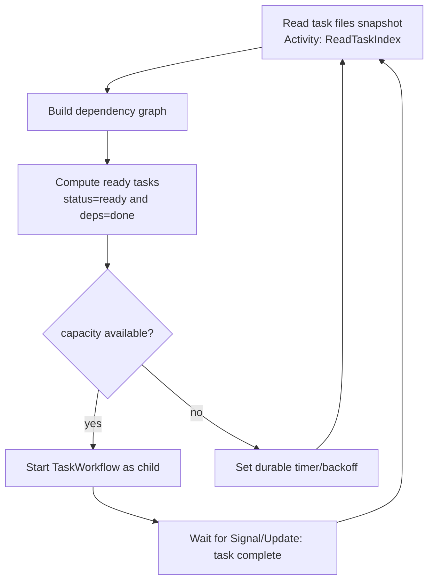
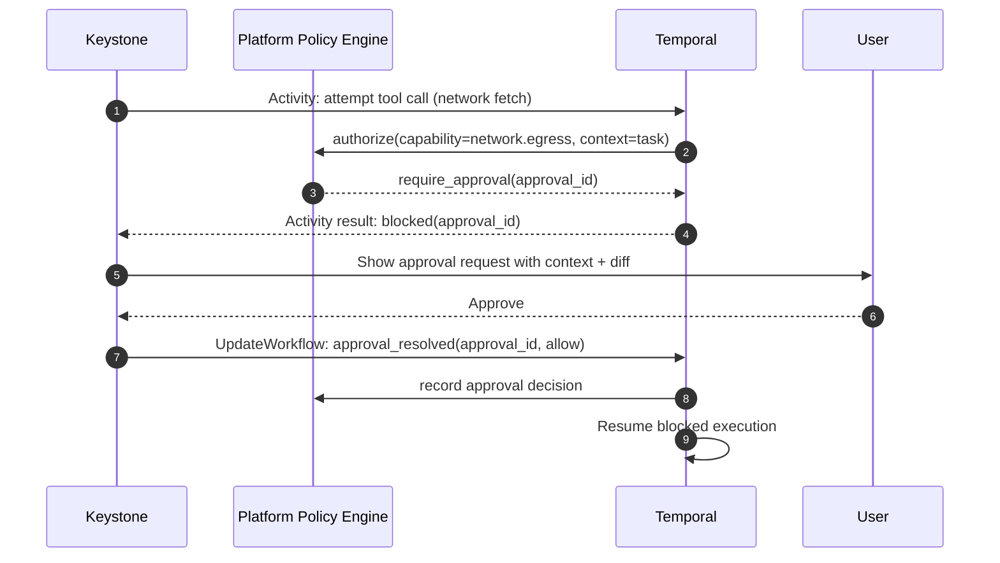

# Keystone Orchestrator on Maestro in a Relaxed, File-First Design

## Executive summary

A relaxed, file-first Keystone product should treat repositories and an artifact store as the **source of truth for workflow meaning** (specs, ADRs, tasks, review notes, test summaries, evidence bundles), while Maestro and Temporal provide **durable runtime mechanics** (sessions, sandboxes, workspace bindings, append-only event history, approvals, and worker leases). This preserves your directed engineering workflow (spec → ADR → implementation → review/test/fix loops) without committing to a heavy “compiled plan DAG” contract or a large database of workflow objects.

The practical architecture is “static workflow phases, dynamic scheduling.” Dependencies are declared in lightweight task files (frontmatter) and computed at runtime by the orchestrator reading the files, while task execution is bounded and auditable via platform sessions and an append-only event log.

Temporal is the right durability spine for the orchestrator loop, but Temporal workflows must remain deterministic; the file system and Git operations should be performed in Activities (or by platform workers invoked from Activities), then the workflow reacts via Signals/Updates and durable timers. Temporal’s docs explicitly position workflows as long-lived, replayable executions driven by an event history, with deterministic constraints, durable timers, message passing primitives (signals/queries/updates), child workflows, and stateless workers that can handle very large numbers of blocked executions. citeturn5view0turn6view0turn7view0turn10view0turn11view0turn9view0turn8view0

Maestro's API surface should be a small kernel: sessions, sandboxes, workspace ops, event log, artifact store, policy/secret mediation, and worker leasing. This aligns with patterns in modern managed-agent systems: decouple the “session log” from the “harness” and “sandbox,” keep the session as an append-only log outside the sandbox, make sandboxes replaceable “cattle,” and ensure secrets are not reachable from untrusted code in the execution environment. citeturn22view0

## Repository vocabulary

For this repository, use these names consistently:

- `Maestro` is the reusable platform kernel. References to the `platform kernel` describe Maestro's generic execution role, not a separate subsystem.
- `Keystone` is the software-delivery product on top of Maestro.
- `Maestro` owns reusable execution mechanics such as sessions, threads, sandboxes, workspaces, artifacts, approvals, and leases.
- `Keystone` owns software-delivery meaning such as `DecisionPackage`, `ProductSpec`, `ADR`, `TaskContract`, `ReviewNote`, `TestSummary`, `EvidenceBundle`, `Run`, and `IntegrationRecord`.

## Architecture and boundary

The key design move is to split **execution substrate** from **software-delivery semantics**:

Maestro is responsible for running and governing “agent work.” Keystone is responsible for deciding “what software-delivery step happens next,” using files as the main contract.

### Maestro versus Keystone responsibilities

| Concern | Maestro responsibility | Keystone responsibility |
|---|---|---|
| Execution isolation | Provision sandboxes; enforce filesystem/network/process isolation and quotas | Choose what needs isolation (per-run session vs per-task sandbox) and how strict |
| Workspaces and Git | Initialize repo, manage workspace strategy (worktrees vs clones), provide safe git ops wrappers | Decide branching strategy, interpret diffs, decide which task runs on which baseline |
| Durability | Persist session registry + event log + lease state + approval state | Persist workflow meaning as files; use Temporal for durable orchestration logic |
| Policy and secrets | Evaluate capability grants; mediate secrets so they’re not directly readable by untrusted sandbox code | Declare policy needs per phase/task class; choose when to request approvals/escalate |
| Observability | Append-only event log; artifact storage; streaming to UI | Interpret events into workflow progress; attach events/artifacts back to task files/evidence bundles |
| Scheduling | Provide worker leasing primitives; enforce “one executor owns this slot” | Compute ready tasks from files; schedule implement/review/test loops; backoff/retry/escalate |

This architecture is consistent with external patterns: the “session is an append-only log,” the harness writes events (`emitEvent`) to a session outside the sandbox, and sandboxes are replaceable tools (`provision`, `execute`) rather than long-lived pets. citeturn22view0

## Maestro primitives and APIs Keystone relies on

The Maestro primitives below should be treated as **stable contracts** Keystone calls, regardless of how Keystone’s file formats evolve.

### Minimum Maestro contract Keystone can assume during `M1`

Keystone should assume the following kernel contract is stable before implementation begins:

- `AgentDefinition`, `EnvironmentDefinition`, `RuntimeProfile`, and `SessionSpec` are the named configuration inputs.
- `Session`, `WorkspaceInstance`, `SessionEvent`, and `ArtifactRef` are the minimum runtime primitives that `M1` will actually exercise.
- `Thread`, `Approval`, and `Lease` are already part of the contract vocabulary, but they are extension points that become operational in later milestones.

Keystone should also assume one explicit session path for the first runnable slice:

`configured -> provisioning -> ready -> active -> archived`

That path is enough for intake, run start, artifact inspection, and event playback. `paused_for_approval` is part of the named lifecycle now, but it does not have to be fully exercised until `M2`.

### Sessions

A session is the unit that binds an agent/harness + sandbox + workspace + policy context, and is addressable by ID. The most important property is that sessions generate an **append-only event stream** decoupled from the sandbox, so clients can resume and audit. This mirrors the “session log sits outside the harness” design described in managed-agent architectures. citeturn22view0

Suggested minimal API shape for the `M1` slice:

- `start_session(session_spec) -> session_id`
- `get_event_history(session_id, cursor, filters) -> events[]`
- `end_session(session_id, mode=archive|delete)`

`start_thread(...)` remains part of the named Maestro contract, but Keystone should treat it as a later extension rather than an `M1` prerequisite.

### Sandboxes

A sandbox is the execution boundary for code+tools. Treat as “cattle”: provision on demand; replace on failure. citeturn22view0

Minimal API for the `M1` slice:

- `provision_sandbox(session_id, env_def, runtime_profile) -> sandbox_id`
- `exec_tool(sandbox_id, tool_call) -> tool_result`
- `teardown_sandbox(sandbox_id)`

### Workspaces

Workspaces provide repo context to tasks. Keystone’s file-first approach benefits from Git-native isolation via worktrees (fast local parallelism), but Maestro should own that complexity.

Git’s own documentation describes worktrees as multiple working trees attached to the same repo, allowing more than one branch checked out simultaneously while sharing objects; each worktree has its own metadata (e.g., `HEAD`). citeturn13search0

Minimal API for the `M1` slice:

- `workspace_init(session_id, repo_ref, strategy=worktree|clone_fetch) -> workspace_id`
- `workspace_create_task_view(workspace_id, task_id, base_ref) -> {path, branch}`
- `workspace_merge(workspace_id, parents[], strategy=octopus|single_parent) -> merge_result`
- `workspace_snapshot(workspace_id) -> snapshot_ref` (optional but very helpful for determinism)

### Event log

Maestro must provide an append-only event record that is durable and streamable. This is the “ground truth” for execution, debugging, and compliance.

Temporal’s own architecture highlights why an event history matters: workflow progress is recorded as events, and replay reconstructs state by checking commands against that history. citeturn6view0turn9view0 Even if Keystone uses Temporal for orchestration durability, you still want a Maestro execution event log for agent/tool observability and auditing.

Minimal API for the `M1` slice:

- `append_event(session_id, event) -> event_id`
- `stream_events(session_id, cursor) -> SSE/WebSocket`
- `read_events(session_id, filters) -> events[]`

### Artifact store

Artifacts are for durable blobs (logs, diffs, test outputs, evidence zips). Keystone can keep “meaning” in repo files but still needs durable storage for non-repo blobs and for retaining execution evidence even when a sandbox is torn down.

Minimal API for the `M1` slice:

- `put_artifact(kind, bytes, metadata) -> artifact_id`
- `get_artifact(artifact_id) -> bytes`
- `link_artifact(session_id, task_id?, artifact_id)`

### Policy and secret mediation

Maestro should implement capability-checked tool execution and secrets that are *not directly reachable* by untrusted code. Managed-agent systems describe this as a structural security boundary: tokens should never be obtainable from inside the sandbox where generated code runs; instead secrets are bundled into resources (e.g., git remote auth) or fetched through a vault/proxy outside the sandbox. citeturn22view0

Minimal API for the later approval-capable slice:

- `authorize(session_id, capability, context) -> allow|deny|require_approval(approval_id)`
- `request_secret(session_id, secret_ref, scope) -> handle` (never returns raw token to sandbox)
- `proxy_call(session_id, tool, args, secret_handles[]) -> result`

### Worker leases

Worker leases are Maestro's concurrency control for “who owns an execution slot” (session, sandbox, task view, reviewer worker). Temporal workers are conceptually stateless and can “resurrect” blocked workflow executions later; but Keystone still needs a way to prevent two executors from mutating the same workspace view simultaneously. citeturn11view0turn9view0

Minimal API for the later concurrency-capable slice:

- `acquire_lease(resource_type, resource_id, holder_id, ttl) -> lease_id`
- `renew_lease(lease_id) -> ok`
- `release_lease(lease_id) -> ok`

### Example sequence: one task loop using the platform

```mermaid
sequenceDiagram
  autonumber
  participant K as Keystone Orchestrator
  participant T as Temporal Workflow
  participant P as Platform
  participant S as Sandbox
  participant W as Workspace
  participant A as Artifact Store
  participant U as User/Approver

  K->>T: Start RunWorkflow(run_id, repo_ref)
  T->>P: start_session(session_spec)
  P->>S: provision_sandbox(env, policy)
  P->>W: workspace_init(repo_ref, strategy=worktree)

  T->>P: append_event(run.started)
  T->>P: start_thread(role="implementer")
  T->>P: start_thread(role="reviewer")
  T->>P: start_thread(role="tester")

  T->>P: workspace_create_task_view(task_id, base_ref)
  T->>P: acquire_lease(task_view)

  T->>P: send_event(implementer, "Execute task; update task.md; commit changes; write evidence")
  P-->>T: stream events (tool calls, diffs, status)

  T->>P: send_event(reviewer, "Review diff; write review-notes.md")
  T->>P: send_event(tester, "Run tests; write test-summary.md; attach logs")

  T->>A: put_artifact(test_logs)
  A-->>T: artifact_id
  T->>P: append_event(artifact.linked)

  T->>P: release_lease(task_view)
  T->>P: append_event(task.completed)

  alt needs approval (e.g., network)
    P-->>T: append_event(approval.requested)
    T->>U: surface approval to UI
    U-->>T: approve/deny
    T->>P: record approval result
  end

  T->>P: end_session(archive)
```

## Storage model: durable runtime state versus file-backed truth

The core rule set:

- **File-backed**: Anything you want humans to edit, diff, review, and evolve without schema migration.
- **Durable runtime state (DB + event store + Temporal)**: Anything required for correctness under concurrency, crash recovery, auditability, approvals, and sandbox lifecycle.

Temporal’s docs emphasize that workflow progress is recorded in event history, enabling replay and recovery; timers are persisted; workers are stateless; and workflows must follow deterministic constraints. citeturn6view0turn10view0turn11view0turn5view0turn9view0

### What must be durable outside files

| Category | Why it must be durable (not just inferred from files) | Suggested store |
|---|---|---|
| Session registry | You need authoritative lifecycle and bindings (session↔sandbox↔workspace) even if repo files drift | DB table `sessions` |
| Maestro event history | Audit/replay/debug of tool calls, approvals, failures; must outlive sandboxes | Append-only event store (DB table or log service) |
| Approvals state | A run can be blocked awaiting a decision; must survive restarts and support provenance | DB table `approvals` |
| Workspace bindings | Where a task view lives, what base ref it used, what branch/worktree path; required for cleanup & correctness | DB table `workspace_bindings` |
| Worker leases | Prevent concurrent writers to same resource; required for safety and to recover from crashed workers via TTL | DB table `worker_leases` |
| Artifact pointers | Blob references (logs, zips, large outputs) and integrity hashes must persist, even if files are rewritten | DB table `artifact_refs` |
| Orchestration durability | Long-running orchestration needs pause/resume, timers, retries, and replay | Temporal persistence + workflow history |

### What should be file-backed

| Artifact | Canonical location | Why file-backed works well |
|---|---|---|
| `product-spec.md` | repo (or a dedicated “run branch”) | Humans can read/edit; changes are reviewable like code |
| `adr.md` (or `adrs/*.md`) | repo | ADRs are naturally diffable and versioned |
| `task.md` files with lightweight frontmatter | repo | Dependencies + status are transparent and evolvable without DB migrations |
| Review notes | repo (`reviews/*.md`) | Natural to keep alongside tasks and diffs |
| Test summaries | repo (`tests/*.md`) + logs in artifact store | Summaries are readable; raw logs often too big → artifact store |
| Evidence bundles | repo index (`evidence/index.md`) + blobs | Lets you keep a human-auditable manifest plus durable blobs |

## Keystone workflow objects and operator journey

Keystone should use the following object names consistently across planning, file schemas, and UI surfaces:

| Keystone object | Canonical form | Primary operator meaning |
|---|---|---|
| `DecisionPackage` | logical bundle of `ProductSpec`, relevant `ADR` files, and optional constraints/context files | The intake unit an operator reviews before execution starts |
| `ProductSpec` | `product-spec.md` | The primary statement of product intent |
| `ADR` | `adrs/*.md` | The architecture rationale and constraints attached to a decision |
| `Run` | workflow execution record backed by Maestro session/event state plus file-backed run context | The operator-visible execution attempt launched from an approved decision package |
| `TaskContract` | `tasks/TASK-*.md` | One executable delivery unit with scope, dependencies, validations, and evidence requirements |
| `ReviewNote` | `reviews/TASK-*/review-*.md` | A reviewer finding or judgment attached to a task |
| `TestSummary` | `tests/TASK-*/test-summary.md` | A compact validation result for a task or broader run stage |
| `EvidenceBundle` | `evidence/*/index.md` plus linked artifacts | The proof package operators inspect when deciding whether a result is trustworthy |
| `IntegrationRecord` | `integration.md` plus merge/result artifacts | The record of how multiple task outputs were combined and evaluated |

The four operator surfaces from the design boards should be treated as one process narrative, not as four unrelated screens:

1. **Intake and approval** — inspect the `DecisionPackage` by reading the `ProductSpec` and related `ADR` material, then approve creation of a `Run`.
2. **Workflow graph and blockers** — inspect the `Run` as a dependency graph of `TaskContract` objects with readiness and blocker state.
3. **Task execution trace** — inspect one `TaskContract` in motion, together with its `ReviewNote`, `TestSummary`, diff, logs, and artifact links.
4. **Verification and release** — inspect the `EvidenceBundle` and `IntegrationRecord` that justify a release or escalation decision.

This is the stable product journey the roadmap should reference through `M2`. Later milestones can deepen the mechanics, but they should not rename these objects or reorder these operator surfaces without explicitly revising this document.

## Temporal integration patterns for the relaxed orchestrator

Temporal gives you durable orchestration *without* requiring a precompiled plan DAG.

### Principles Keystone should follow when using Temporal

Temporal workflows are defined in code and executed as durable workflow executions recorded in event history; deterministic constraints apply. citeturn5view0turn9view0turn6view0

That implies a crucial implementation rule for Keystone:

- **Do not read the repo filesystem or call Git from Workflow code.** Those are nondeterministic external I/O. Put them in Activities (or platform calls invoked from Activities). Temporal’s model is that a workflow issues commands and waits on awaitables, while “doing work in the environment” happens via activities, timers, child workflows, or message passing. citeturn6view0turn9view0turn11view0

### Recommended workflow decomposition

Use a small set of long-lived workflows with file-backed contracts:

- **RunWorkflow** (one per “run”): owns overall directed phases and scheduling loop.
- **TaskWorkflow** (one per task): implement → review → test → fix loops.
- **IntegrationWorkflow** (optional): merges integrated baselines, resolves conflicts, triggers global checks.
- **ApprovalWorkflow** (optional): durable wait/timeout/escalation for human decisions.

Use Child Workflows sparingly. Temporal explicitly discourages using child workflows *just* for code organization and recommends starting with a single workflow unless there’s a clear need; child workflows are useful to partition workloads and manage event history size constraints. citeturn8view0

### Message passing: signals, updates, queries

Temporal supports signals, queries, and updates; signals are asynchronous “write” messages (fire-and-forget), queries are read-only, and updates are synchronous tracked writes that can return a result or error. citeturn7view0

A practical Keystone mapping:

- **Signals**: “task finished,” “new review posted,” “tests complete,” “approval response received.”
- **Updates**: “register task completion into run state,” “publish evidence bundle,” “accept/deny a scheduling decision.” Use updates when you need an acknowledgment that the workflow accepted the request. citeturn7view0
- **Queries**: UI asks “what tasks are ready?”, “what’s blocked?”, “what’s running?” (read-only view of workflow state). citeturn7view0

### Durable timers and backoff

Temporal timers are persisted and allow workflows to wait without consuming worker resources; a worker can await very large numbers of timers concurrently. citeturn10view0turn11view0

Use timers for:
- “poll plan files again in X seconds”
- “approval expires in 48h → escalate”
- “retry scheduling loop with exponential backoff after transient platform error”

### Retrying: prefer retrying Activities, not whole workflows

Temporal’s docs note that activities have default retry behavior, while workflows do not by default; retries are configured declaratively via retry policies, and it’s generally more efficient to retry failed activities rather than retrying entire workflows. citeturn12view0

For Keystone, that suggests:
- Put platform calls (start session, workspace ops, run tests) in Activities with retries.
- Keep workflow logic stable; if it fails, it often indicates a design/configuration issue rather than a transient failure. citeturn12view0

### Orchestrator responsibilities inside RunWorkflow

The orchestrator is responsible for:
- Reading task files (via Activity) and computing readiness
- Scheduling TaskWorkflows
- Enforcing global concurrency limits (via worker leases + Temporal task queues)
- Converting failures into retries/escalations based on policy
- Posting durable events and writing file updates through controlled channels

A canonical “compute-ready-tasks” loop looks like:



## File schemas and examples

The goal is “just files,” but with *minimal semantic structure* so the orchestrator can compute dependencies reliably without needing a DB schema.

### Suggested repo layout

One pragmatic layout that keeps files discoverable and avoids polluting product docs:

- `product-spec.md`
- `adrs/NNNN-title.md`
- `tasks/TASK-*.md`
- `reviews/TASK-*/review-*.md`
- `tests/TASK-*/test-summary.md`
- `evidence/TASK-*/index.md` (manifest; blobs referenced from artifact store)

If you prefer not to commit run-internal state to the main branch, put these under a dedicated “run branch” (for example `keystone/run/<run-id>`) and merge/pick what you want later.

### Task file with lightweight frontmatter

```markdown
---
id: TASK-032
title: "Add cache headers to /api/export"
status: ready   # ready | in_progress | blocked | done
depends_on: [TASK-010, TASK-021]
phase: implementation
owner_role: implementer
review:
  required: true
  classes:
    - correctness
    - security_privacy
tests:
  required: true
  commands:
    - "pnpm test --filter export"
    - "pnpm lint"
evidence:
  required:
    - diff
    - test_summary
  artifact_kinds:
    - test_logs
constraints:
  network: denied   # denied | approval_required | allowed
retry_budget:
  fix_loops: 3
  task_retries: 2
---

## Goal
Add explicit `Cache-Control` headers so responses are not cached by default.

## Scope boundary
In scope: route handler + tests.
Out of scope: UI changes.

## Completion checklist
- [ ] Code change committed
- [ ] Review notes addressed
- [ ] Tests passed and summarized
- [ ] Evidence bundle updated
```

Dependency computation is just “parse frontmatter → build graph.” Keystone can treat everything after YAML as human-readable guidance.

### ADR file

```markdown
---
adr: 0007
title: "Export endpoint caching policy"
status: accepted   # proposed | accepted | superseded
date: 2026-04-10
owners: ["platform-team"]
related_tasks: [TASK-032]
---

## Context
We need a default caching posture for export responses.

## Decision
Set `Cache-Control: no-store` by default for export responses.

## Consequences
- Slight perf cost; avoids risk of caching sensitive payloads.
```

### Product spec file

```markdown
---
product: "Export API"
version: 0.3
status: approved   # draft | approved
owners: ["pm", "eng-lead"]
acceptance:
  - "Exports are never cached by browsers or proxies by default"
  - "Export works in offline tests"
---

## Problem statement
...

## User stories
...

## Non-functional requirements
- Security: avoid caching sensitive exports
- Reliability: exports must be resumable
```

### Review note file

```markdown
---
task: TASK-032
reviewer_class: correctness
blocking: true
created_at: 2026-04-10T18:12:00Z
---

## Findings
1. Header is only set on success path; add to error paths too.
2. Add regression test covering 4xx responses.
```

### Test summary file

```markdown
---
task: TASK-032
suite: "pnpm test --filter export"
status: pass   # pass | fail
artifact_refs:
  - kind: test_logs
    id: artifact_abc123
---

## Summary
All export tests passed. Added a regression test for error-path cache headers.
```

### Evidence bundle manifest

Keep a small manifest in repo, but store bulky artifacts in the artifact store:

```markdown
---
task: TASK-032
status: complete
artifacts:
  - kind: diff
    ref: git:branch=keystone/task/TASK-032
  - kind: test_logs
    ref: artifact:artifact_abc123
  - kind: transcripts
    ref: artifact:artifact_xyz999
---

## Evidence narrative
- Implemented cache headers per ADR-0007
- Verified success + error paths, via tests
```

## Minimal durable database schema and event model

Even in a file-first design, a minimal DB layer is the cleanest way to support leases, approvals, and session lifecycle.

### Minimal tables

| Table | Purpose | Key columns |
|---|---|---|
| `sessions` | Session registry + lifecycle | `session_id`, `run_id`, `status`, `env_def`, `workspace_id`, `created_at`, `ended_at` |
| `session_events` | Append-only platform events | `event_id`, `session_id`, `ts`, `type`, `payload_ref`, `actor`, `seq` |
| `approvals` | Durable approvals/escalations | `approval_id`, `session_id`, `kind`, `state`, `request_event_id`, `resolved_by`, `resolved_at` |
| `workspace_bindings` | Where the repo/task views live | `workspace_id`, `session_id`, `strategy`, `repo_ref`, `base_ref`, `paths` |
| `worker_leases` | Concurrency control | `lease_id`, `resource_type`, `resource_id`, `holder_id`, `expires_at`, `heartbeat_at` |
| `artifact_refs` | Durable pointers to blobs | `artifact_id`, `session_id`, `kind`, `uri`, `sha256`, `created_at` |

This DB is intentionally *not* a workflow object model. It’s operational state only.

### Event model

Use an immutable event envelope:

- `event_id`: ULID/UUID
- `session_id`, optional `task_id`, `run_id`
- `seq`: monotonic per session (or per stream)
- `type`: `domain.action` (e.g., `sandbox.provisioned`)
- `actor`: `keystone`, `worker:<id>`, `user:<id>`
- `payload_ref`: inline JSON for small payloads; otherwise artifact reference

Suggested event types (starter set):
- `session.started`, `session.archived`, `session.error`
- `sandbox.provisioned`, `sandbox.teardown`
- `workspace.initialized`, `workspace.task_view_created`, `workspace.merged`
- `lease.acquired`, `lease.renewed`, `lease.released`
- `agent.tool_call`, `agent.tool_result`, `agent.message`
- `approval.requested`, `approval.resolved`
- `task.status_changed` (optional; even if task status is file-backed, emitting events makes UI reactive)
- `artifact.put`, `artifact.linked`

Retention and replay:
- Treat the platform event log as the audit trail; retain longer than sandbox lifetime.
- Temporal’s event history is already designed for replay of workflow logic; keep workflow input small and keep large blobs in artifacts. citeturn6view0turn9view0turn11view0
- If you anticipate very long runs with frequent events, plan for “session event compaction” (store full history but index + snapshot derived state), analogous in spirit to Temporal replay pragmatics and child workflow partitioning to manage history size. citeturn8view0turn9view0

## Security, policy, and secret flow

A file-first design increases the pressure to get **secret hygiene** right, because “everything is files” can otherwise accidentally include credentials.

### Recommended security posture

- Secrets *never* live in repo files or task frontmatter.
- The platform enforces capability checks on tool invocations, with an approval pathway for sensitive operations (network, privileged commands, writes outside allowed roots). This mirrors how agent products implement approval gates and scoped permissions in practice. citeturn21view0turn17view0turn16view0
- Use a **secret broker** or proxy so tokens are not readable from inside the sandbox. This is described explicitly as a structural boundary in managed-agent systems: bundle auth into resources (e.g., git remote configured during clone) or use a vault/proxy for OAuth and external tool calls. citeturn22view0
- If sensitive data must pass through Temporal, use Temporal’s recommended mechanisms for protecting data in histories (e.g., SDK-level data conversion/encoding) and keep large/sensitive payloads out of workflow history by storing them as artifacts referenced by ID. Temporal notes that workers can customize serialization via a Data Converter API; and that, by default, data may be readable at rest in the service without additional measures. citeturn11view0

### Approval flow example



## Developer UX, adoption story, migration strategy, and tradeoffs

### Developer UX and adoption story

The file-first model is adoptable because it matches how engineering orgs already work:

- Specs and ADRs are Markdown in a repo (or adjacent repo).
- Tasks are human readable and can be edited manually when needed.
- Reviews and test summaries are inspectable as plain files, with deep links to logs/artifacts.
- If Keystone is off, the repo still contains the workflow state; humans can take over without translating from a proprietary plan schema.

These are the same usability primitives that have proven useful in production agent tooling: durable threads, event history, worktrees for parallel agent changes, and approvals gating sensitive operations. citeturn16view0turn17view0turn21view0turn13search0

### Migration from the current compiled-plan spec

Your existing spec emphasizes an “execution substrate as structured control-plane state” (Executable Plan, Task Contracts, run records) and DAG-based execution. The migration should be framed as **moving meaning into files and leaving only operational mechanics in systems state**.

A pragmatic migration map:

| Current concept | File-first equivalent |
|---|---|
| Decision Package | `product-spec.md` + `adrs/*.md` (+ optional `constraints.md`) |
| Executable Plan | `tasks/*.md` + optional `run.md` summary (no compiled artifact required) |
| Task Contract | `tasks/TASK-*.md` frontmatter + body |
| Task Run Record | Maestro event stream + transcript artifact + git commit history |
| Integration Record | `integration.md` + merge artifacts + events |
| Release Evidence Pack | `evidence/*/index.md` manifests + stored blobs |

Implementation strategy:
- Keep your existing per-task “implement → review → validate → fix” loop, but redefine the “contract” as the task file + evidence manifest.
- Replace “compile DAG” with “compute graph from task file frontmatter at runtime.”
- Keep centralized integration semantics if it’s important for safety, but represent baselines as refs + files, not as large typed objects.

### Risks and tradeoffs

File-first buys flexibility, but you need explicit mitigations:

- **Race conditions on task files**: If multiple workers edit task status/evidence simultaneously, you can get conflicts. Mitigate with worker leases + “single writer per task file” policy, and write task status updates in a controlled Activity that serializes updates. (Leases are operational state; keep them durable.)  
- **Orchestrator determinism pitfalls**: Reading filesystem state directly in Temporal workflow code is nondeterministic; keep all file reads/writes in Activities and signal/update the workflow with the result. Temporal’s determinism and replay model makes this non-negotiable. citeturn5view0turn6view0turn9view0
- **History growth**: Both platform event logs and Temporal workflow histories can grow large. Temporal recommends starting with simpler designs than heavy child-workflow fanouts unless needed; child workflows can help partition history when sizes become limiting. citeturn8view0turn9view0
- **Schema drift**: If you allow arbitrary task file formats, dependency computation becomes brittle. The compromise is “freeform body + tiny stable frontmatter.”
- **Security leakage into files**: “Everything is files” is dangerous if secrets creep into repos. Enforce hard checks in the platform, mirror managed-agent patterns that keep tokens out of sandboxes, and require approvals for risky capabilities. citeturn22view0turn21view0turn17view0
- **Discoverability/querying**: Without a workflow-object DB, querying “all blocked tasks across runs” is harder. Mitigate by indexing task frontmatter into a small search table (optional) while keeping files canonical.

The net trade is favorable for a product you want organizations to adopt: **files keep workflow semantics legible and evolvable**, while Maestro + Temporal keep execution safe, durable, and inspectable.
